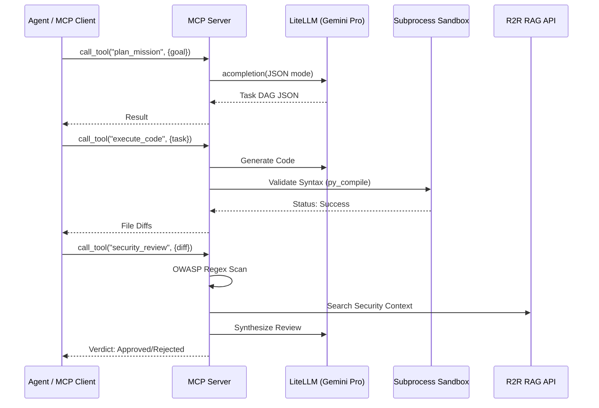

# Software Requirements Specification (SRS): MCP Server Package

## 1. Introduction

### 1.1 Purpose

The `mcp` package provides an implementation of the Model Context Protocol (MCP) to expose autonomous AI capabilities as a suite of standardized tools. It enables complex agentic workflows like mission planning, code execution, and security analysis within the `autogen_team` framework.

### 1.2 Scope

This document covers the `MCPService` lifecycle management, the MCP server bootstrap, and the integration of the 6 core tools: `plan_mission`, `execute_code`, `run_tests`, `security_review`, `retrieve_context`, and `index_code`.

### 1.3 REPOSITORY CONTEXT

> [!IMPORTANT]
> Link to relevant directories in the repository for requirements context.

- **MCP Application**: [application/mcp](file:///home/lgcorzo/llmops-python-package/src/autogen_team/application/mcp)
- **MCP Tools**: [tools](file:///home/lgcorzo/llmops-python-package/src/autogen_team/application/mcp/tools)
- **MCP Service**: [mcp_service.py](file:///home/lgcorzo/llmops-python-package/src/autogen_team/infrastructure/services/mcp_service.py)

## 2. Overall Description

### 2.1 Product Perspective

The MCP Server acts as a bridge between LLM agents and the local environment/external knowledge. It resides in the `application` layer but relies on the `infrastructure` layer for LiteLLM and R2R RAG connectivity.

## 3. Specific Requirements

### 3.1 Functional Requirements

- **Tool Registration**: Must register all 6 tools with valid JSON Schema definitions.
- **Mission Planning**: Must decompose high-level goals into parallelizable task DAGs using LiteLLM.
- **Sandboxed Execution**: Must generate code changes and validate them in a transient sandbox environment (syntax checking).
- **Security Review**: Must perform multi-layered security analysis using OWASP regex patterns and R2R RAG context retrieval.
- **RAG Integration**: Must support semantic search and document indexing via the R2R API.
- **Configurable Prompts**: System prompts and instruction templates must be externalized to `confs/mcp_prompts.yaml` for dynamic tuning.
- **CLI Interface**: Must support overriding the prompts configuration path via the `--prompts` argument in the `invoke` task.
- **Transport**: Must support `stdio` transport as the primary communication channel for MCP clients.

### 3.2 Non-Functional Requirements

- **Isolation**: Test execution must happen in a subprocess-based sandbox to prevent side effects on the host.
- **Extensibility**: The sandbox architecture must use a `SandboxBackend` abstract interface for future Firecracker MicroVM support.
- **Reliability**: Must handle API timeouts and connection errors gracefully when calling LiteLLM or R2R.

## 4. Use Cases

### 4.1 Autonomous Feature Implementation

- **Actors**: AI Agent / Developer
- **Description**: Use the MCP tools to plan and implement a new feature.
- **Main Flow**:
  1. `plan_mission` to get the task list.
  2. `retrieve_context` to understand existing patterns.
  3. `execute_code` to generate the implementation.
  4. `run_tests` to verify the code.
  5. `security_review` to ensure compliance.
  6. `index_code` to update the RAG knowledge graph.

## 5. Visualizations (Mermaid)

### 5.1 Execution Diagram (Tool Workflow)

---

_Template generated for Agentic workflows._
