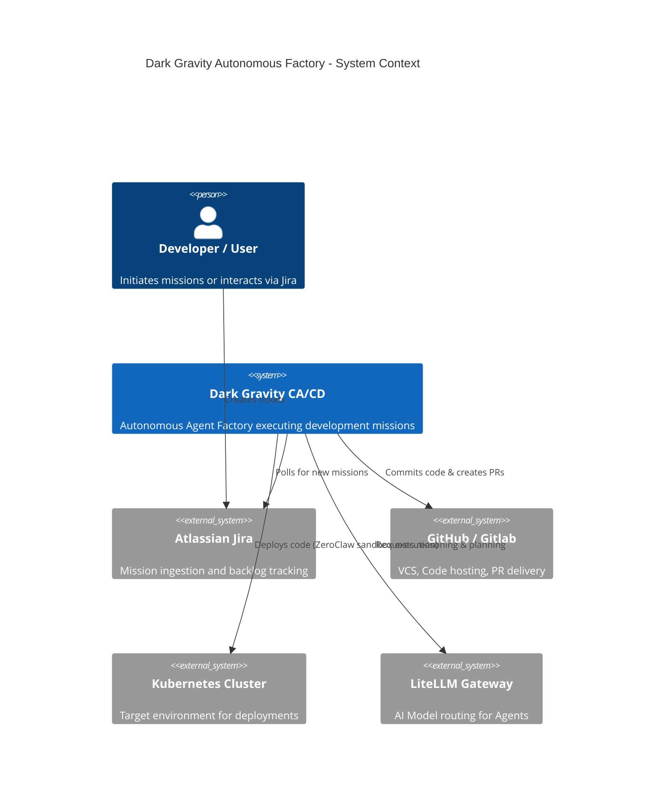
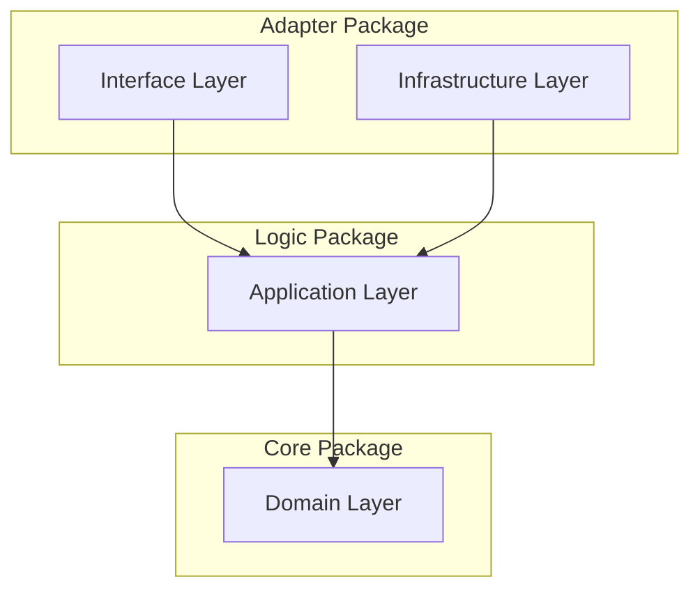

# STRATEGIC-DESIGN: Dark Gravity Architecture

This document defines the **Strategic Design** of the Dark Gravity autonomous factory, focusing on **Bounded Contexts**, **Context Maps**, and the **Onion Architecture** layers.

---

## Bounded Contexts

The system is partitioned into four bounded contexts to ensure isolation and clear ownership of logic.

| Context | Responsibility | Key Entities | Agent |
| :--- | :--- | :--- | :--- |
| **Intelligence** | Strategic mission planning via R2R context retrieval. | `Mission`, `Goal`, `Context`, `Plan` | Rustant (Planner Agent) |
| **Execution** | Code implementation and sandbox validation. | `Task`, `TestResult`, `Artifact` | ZeroClaw (Executor Agent) |
| **Remediation** | Detecting and reacting to CI/CD or production failures. | `Alert`, `Symptom`, `Fix` | DevOps Agent (Auto-Remediation) |
| **Infrastructure** | Adapters for external services and secured connectivity. | `Client`, `Credential`, `Stream` | Documentation Agent |

---

## Onion Architecture

The project follows a strict **Onion Architecture** within each crate to maintain testability and framework independence.

### DDD Layer Mapping

| Layer | Crate / Responsibility | Focus |
| :--- | :--- | :--- |
| **Domain** | `factory-core` | Business entities, aggregate roots, and domain logic. `Mission`, `Task`, `MissionStatus`, `SecurityValidator` trait, `SecurityBounds` trait, `FactoryError`. |
| **Application** | `factory-application` | Orchestrates use cases. Hatchet Workflows (6-phase DAG), Rustant & ZeroClaw agent logic. |
| **Infrastructure** | `factory-infrastructure` | External adapters (Kafka, R2R GraphRAG, Jira, S3, OpenZiti, Vault, MCP client). |
| **Interface** | `factory-mcp-server` / `factory-cli` | External entry points (Axum MCP server with SSE/HTTP, CLI Hatchet worker). |

---

## Zero Trust & Sovereignty

Security is baked into the strategic design of every context:

- **Identity-First**: `SecurityValidator` trait for content auditing and Ed25519 signature verification.
- **Dark Network**: All inter-service communication routed through **OpenZiti** mTLS 1.3 tunnels — zero publicly routable ports.
- **Dynamic Access**: Short-lived JIT tokens provisioned dynamically via **Vault** (`SecurityBounds`).
- **Sandbox Execution**: Untrusted code executes in **Firecracker** micro-VMs or via a `SubprocessDriver` for isolated sandboxing.
- **Credential Management**: API keys and tokens loaded via environment variables, never hardcoded.

---

## Autonomous Workforce

| Agent | Context | Primary Tools | DAG Step |
| :--- | :--- | :--- | :--- |
| **Rustant** (Planner Agent) | Intelligence | R2rClient for semantic context search, `plan_mission` MCP tool | Planning, Review |
| **ZeroClaw** (Executor Agent) | Execution | `execute_code` MCP tool, `run_tests` MCP tool, Firecracker sandbox | Code, Validate |
| **DevOps Agent** | Remediation | Auto-Remediation Loop, Sentry integration | CI/CD Healing |
| **Documentation Agent** | Infrastructure | Superpowers skills (`writing-plans`, `subagent-driven-development`) | Wiki Sync |

---

## Agentic Pipeline

The system orchestrates missions through a durable **6-phase Hatchet DAG**:

1. **Ingestion** → Parse Jira requirements into structured tasks
2. **Plan (Rustant)** → Use R2rClient for semantic context retrieval and mission planning
3. **Code (ZeroClaw)** → Generate and execute code in sandboxed environment
4. **Validation (ZeroClaw)** → Run tests and validate outputs
5. **Review (Rustant)** → Review results and provide feedback
6. **Delivery (GitOps)** → Commit and push changes

State is managed via `StepCheckpoint`s persisted to Hatchet's PostgreSQL backend, enabling crash-resilient mission execution.

---

## CRG-Verified Structure

Based on `code-review-graph` analysis, the actual codebase structure is:

### Workspace Crates

| Crate | Nodes | Edges | Role |
|-------|-------|-------|------|
| `factory-core` | 12 | — | Domain models (`Mission`, `Task`, `SecurityValidator`, `SecurityBounds`) |
| `factory-application` | 21 | — | Agents (Rustant, ZeroClaw) + Workflows |
| `factory-mcp-server` | 101 | — | MCP server, tools (8 tools), sandbox drivers |
| `factory-infrastructure` | 42 | — | Service clients (Jira, R2R, Kafka, MCP, S3, Ziti, Vault, Ed25519) |
| `factory-cli` | 3 | — | CLI entry point |

### Agent Relationships (CRG Edge Graph)

- **Rustant** → calls `r2r_client.search()` + `mcp_client.call_tool_json()`
- **ZeroClaw** → calls `mcp_client.call_tool_json()` for code execution + validation
- **Mission Workflow** → orchestrates Rustant (plan) → ZeroClaw (code) → Rustant (review)
- **Task Workflow** → handles individual task execution with checkpointing

---

## ADR Index

| ADR | Title | Status |
| :--- | :--- | :--- |
| ADR-001 | Hardware-Virtualized Sandboxing (Firecracker) | Implemented |
| ADR-002 | Durable Orchestration via Hatchet DAG | Implemented |
| ADR-003 | Semantic Memory via R2R GraphRAG | Implemented |
| ADR-004 | Agent-Driven Development (Rustant + ZeroClaw) | Implemented |
| ADR-005 | Superpowers Framework for Agent Skills | Implemented |
| ADR-006 | Zero Trust Network with OpenZiti Dark Overlay | Implemented |
| ADR-007 | LiteLLM Gateway for Model Routing | Implemented |

---

*Last updated: 2026-07-02 — Verified against actual codebase via CRG analysis*