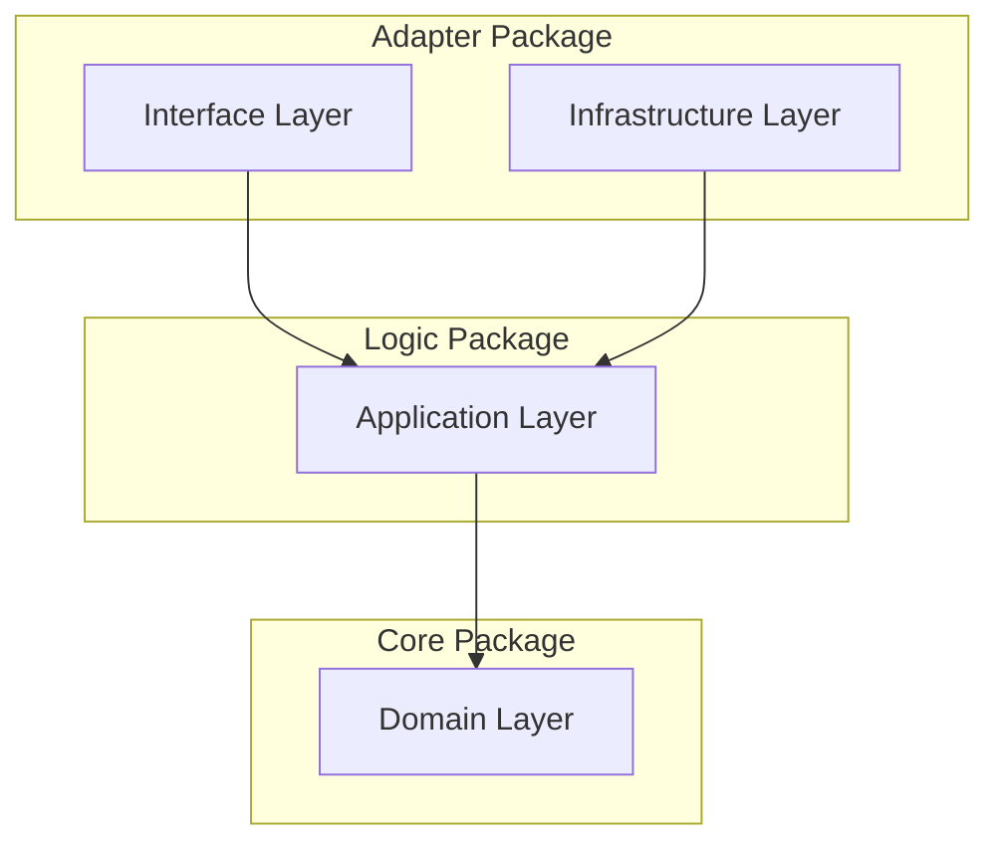

# STRATEGIC-DESIGN: Dark Gravity Architecture

This document defines the **Strategic Design** of the Dark Gravity autonomous factory, focusing on **Bounded Contexts**, **Context Maps**, and the **Onion Architecture** layers.

---

## Bounded Contexts

The system is partitioned into four bounded contexts to ensure isolation and clear ownership of logic.

| Context | Responsibility | Key Entities | Agent |
| :--- | :--- | :--- | :--- |
| **Intelligence** | Strategic mission planning and reasoning. | `Spec`, `Plan`, `Task`, `Strategy` | Rustant (PO Agent) |
| **Execution** | Code implementation and sandbox validation. | `Artifact`, `TestResult`, `Diff` | ZeroClaw (Developer Agent) |
| **Remediation** | Detecting and reacting to CI/CD or production failures. | `Alert`, `Symptom`, `Fix` | DevOps Agent (Aethelgard Loop) |
| **Infrastructure** | Adapters for external services, documentation, and secured connectivity. | `Client`, `Credential`, `Stream`, `Wiki` | Documentation Agent |

---

## Onion Architecture

The project follows a strict **Onion Architecture** within each crate to maintain testability and framework independence.

### DDD Layer Mapping

| Layer | Crate / Responsibility | Focus |
| :--- | :--- | :--- |
| **Domain** | `factory-core` | Business entities, aggregate roots, and domain logic. `Mission`, `Task`, `MissionStatus`, `SecurityValidator`, `FactoryError`. |
| **Application** | `factory-application` | Orchestrates use cases. Hatchet Workflows (6-phase DAG including Ingestion), Agent Logic. |
| **Infrastructure** | `factory-infrastructure` | External adapters (Kafka, R2R GraphRAG, Jira, S3, OpenZiti, Sentry). |
| **Interface** | `factory-mcp-server` / `factory-cli` | External entry points (Axum MCP server with SSE, CLI Hatchet worker). |

---

## Zero Trust & Sovereignty

Security is baked into the strategic design of every context:

- **Identity-First**: Non-Human Identities (NHI) with Ed25519 Verifiable Credentials for every agent action.
- **Dark Network**: All inter-service communication routed through **OpenZiti** mTLS 1.3 tunnels — zero publicly routable ports.
- **Hardware-Isolated Sandbox**: Untrusted code executes in **gVisor** (K8s `runtimeClassName: gvisor`) or **Firecracker** micro-VMs with `AF_VSOCK` communication.
- **Forensic Memory**: JIT credentials wiped from RAM within 4.33 μs via `zeroize`.

---

## Autonomous Workforce

| Agent | Context | Primary Toolchain | DAG Step |
| :--- | :--- | :--- | :--- |
| **Rustant** (PO Agent) | Intelligence | Spec-Kit SDD (`speckit-specify`, `speckit-plan`, `speckit-tasks`) | Planning, Review |
| **ZeroClaw** (Developer Agent) | Execution | Aider CLI, `execute_code`, `run_tests` | Code, Validate |
| **DevOps Agent** | Remediation | Aethelgard Auto-Remediation Loop, Sentry poller | CI/CD Healing |
| **Documentation Agent** | Infrastructure | Superpowers skills (`writing-plans`, `subagent-driven-development`, `verification-before-completion`) | Wiki Sync |

---

## Agentic Pipeline (Spec-Kit + Superpowers Bridge)

The **superspec** orchestrator bridges Spec-Kit (planning) with Superpowers (execution):

1. **Spec-Kit Pipeline**: `constitution → specify → clarify → plan → tasks → implement → taskstoissues`
2. **State Transfer**: `superspec` parses Spec-Kit artifacts (`spec.md`, `plan.md`, `tasks.md`) into `BridgeState` with `StepCheckpoint`s
3. **Durable Execution**: Hatchet DAG executes steps; crashed workers resume from last checkpoint via `superspec`
4. **Verification Feedback**: Superpowers' `verification-before-completion` feeds OSR < 5% results back into Spec-Kit validation

---

## ADR Index

| ADR | Title | Status |
| :--- | :--- | :--- |
| ADR-001 | Hardware-Virtualized Sandboxing (gVisor / Firecracker) | Implemented |
| ADR-002 | Durable Orchestration via Hatchet DAG | Implemented |
| ADR-003 | Semantic Corporate Memory via pgvector & R2R GraphRAG | Implemented |
| ADR-004 | Spec-Kit SDD as PO Agent Planning Protocol | Implemented |
| ADR-005 | Superpowers Framework as Documentation Agent's Skill Engine | Implemented |
| ADR-006 | Zero Trust Network with OpenZiti Dark Overlay | Implemented |
| ADR-007 | Spec-Kit + Superpowers Bridging (superspec) | Implemented |
| ADR-008 | NHI, FinOps, Closed-Loop QA, R&D Packaging | Implemented |
