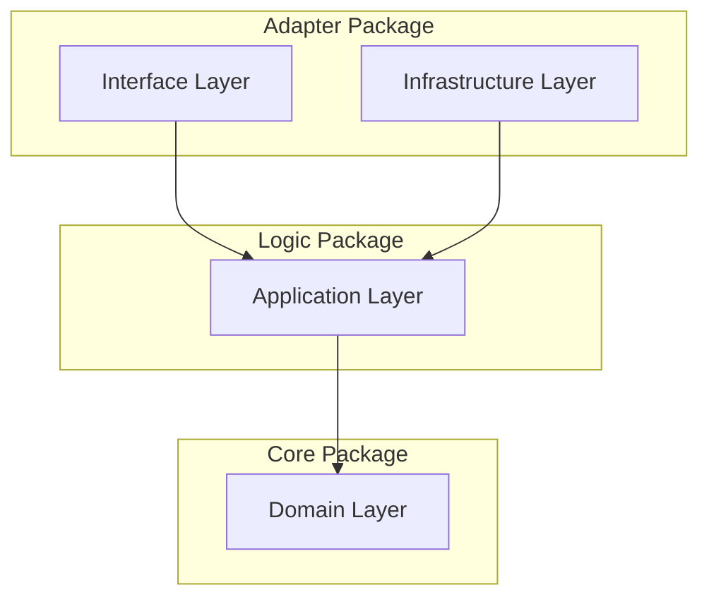

# 🏗️ STRATEGIC-DESIGN: Dark Gravity Architecture

This document defines the **Strategic Design** of the Dark Gravity autonomous factory, focusing on **Bounded Contexts**, **Context Maps**, and the **Onion Architecture** layers.

---

## 🗺️ Bounded Contexts

The system is partitioned into four primary bounded contexts to ensure isolation and clear ownership of logic.

| Context | Responsibility | Key Entities |
| :--- | :--- | :--- |
| **Intelligence** | Strategic mission planning and reasoning. | `Plan`, `Thought`, `Strategy` |
| **Execution** | Code implementation and sandbox validation. | `Artifact`, `TestResult`, `Diff` |
| **Remediation** | Detecting and reacting to external failures (e.g., K8s errors). | `Alert`, `Symptom`, `Fix` |
| **Infrastructure** | Adapters for external services and secured connectivity. | `Client`, `Credential`, `Stream` |

---

## 🧅 Tactical Implementation (Onion Architecture)

The project follows a strict **Onion Architecture** within each crate to maintain testability and frame-work independence.

### 🧱 DDD Layer Mapping

| Layer | Crate / Responsibility | Focus |
| :--- | :--- | :--- |
| **Domain** | `factory-core` | Business entities, aggregate roots, and domain logic. (e.g., `MissionStatus`) |
| **Application** | `factory-application` | Orchestrates use cases. Houses Hatchet Workflows and Agent Logic. |
| **Infrastructure** | `factory-infrastructure` | External adapters (GitHub, Kafka, R2R) and technical persistence. |
| **Interface** | `factory-mcp-server` / `factory-cli` | External entry points (RPC, CLI, SSE). |

---

## 🛠️ Tooling & LLMOps Lifecycle

The integration of LLMs is managed via the **Model Context Protocol (MCP)**, ensuring a standardized interface between agents and the world.

### MCP Tool Lifecycle
1. **Request**: Agent identifies a need (e.g., "I need to read `Cargo.toml`").
2. **Context Selection**: The **Context Tool** fetches relevant RAG data from R2R.
3. **Execution**: The agent invokes the specific tool (e.g., `read_file`).
4. **Validation**: The tool's output is verified for data integrity before being returned to the agent's context.

---

## 🛡️ Zero Trust & Sovereignty

Security is baked into the strategic design of every context:
- **Identity-First**: No component trusts another without a verified identity.
- **Micro-Segmentation**: Individual agent pods are isolated via Network Policies.
- **Ephemeral Sandbox**: All implementation logic is executed in single-mission Firecracker VMs.
