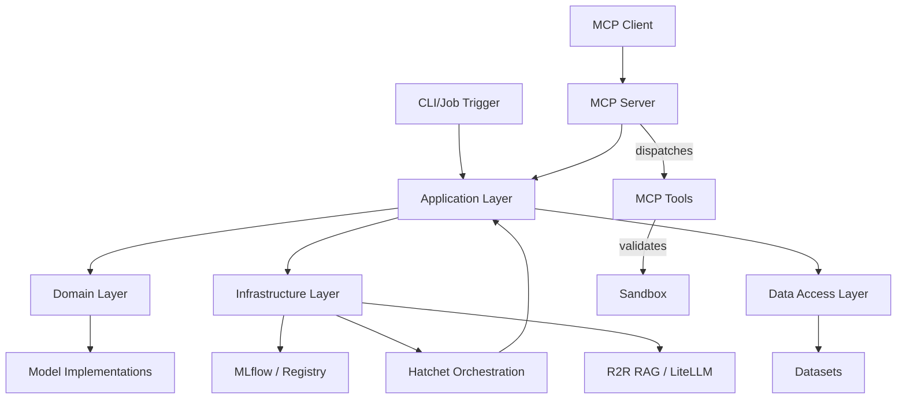

# Solution Architecture Report (SAR): LLMOps Autogen Team

The project follows **Domain-Driven Design (DDD)** and **Onion Architecture** to ensure modularity and maintainability.

## 2. MLOps 2026 Lifecycle
Every mission is managed as a **MLflow Experiment**. Metrics tracked include:
- `remediation_success`: Binary (0/1) for cluster fixes.
- `commit_latency`: Time from code change to PR creation.
- `resource_usage`: CPU/Memory consumption of the Runner sidecar.
- `token_cost`: Financial cost based on LiteLLM telemetry.

## 2. REPOSITORY STRUCTURE & LINKS

> [!IMPORTANT]
> Map the repository layers to the architecture.

- **Root Directory**: [Root](file:///mnt/F024B17C24B145FE/Repos/rust_CACD_autonomous_factory)
- **Application Layer**: [factory-application](file:///mnt/F024B17C24B145FE/Repos/rust_CACD_autonomous_factory/crates/factory-application) -> Hatchet Workflows, Agents (Rustant, ZeroClaw, GravityRunner).
- **Domain Layer**: [factory-core](file:///mnt/F024B17C24B145FE/Repos/rust_CACD_autonomous_factory/crates/factory-core) -> Pure Business Logic, Shared Models, Security Protocols.
- **Infrastructure Layer**: [factory-infrastructure](file:///mnt/F024B17C24B145FE/Repos/rust_CACD_autonomous_factory/crates/factory-infrastructure) -> Adapters for GitHub, R2R, Kafka, Jira, OpenZiti.
- **Interface Layer**: [factory-mcp-server](file:///mnt/F024B17C24B145FE/Repos/rust_CACD_autonomous_factory/crates/factory-mcp-server) -> MCP Server, Tools, SSE Transport.

## 3. Layer Detail

### 3.1 Domain Layer

- **Entities**: Autogen Models, Metrics, Schemas.
- **Value Objects**: Model Configurations, Evaluation Results.
- **Domain Services**: Registry Services, Model Promotion Logic.

### 3.2 Application Layer

- **Jobs/Use Cases**: AutonomousMission (6-Phase DAG), DevelopTask, RemediateError.
- **MCP Server**: Autonomous tool coordinator (factory-mcp-server).
- **DTOs**: MissionInput, MissionOutput, CallToolRequest/Response.

### 3.3 Infrastructure Layer

- **External Services**: MLflow (for tracking), Hatchet (for orchestration), Kafka (telemetry), LiteLLM (LLM gateway), R2R (RAG engine), GitHub (Direct Actions).
- **Adapters**: JiraClient, R2rClient, GitHubClient, KafkaClient, MCP Tools (plan_mission, execute_code, fix_pr_commit, security_review, retrieve_context).

### 3.4 Data Access Layer

- **Repositories**: DatasetRepository, RegistryRepository.
- **Datasets**: Training data, Evaluation sets.

## 4. LLM Component Interactions

- **Vector Database**: R2R RAG (Knowledge Graph + Vector)
- **LLM Provider**: Autogen (Microsoft), LiteLLM (Gemini Pro)
- **Embedding Model**: Managed by R2R

## 5. Design Diagrams

> [!TIP]
> Use Mermaid for dynamic diagrams.

---

_Template generated for Agentic workflows._
