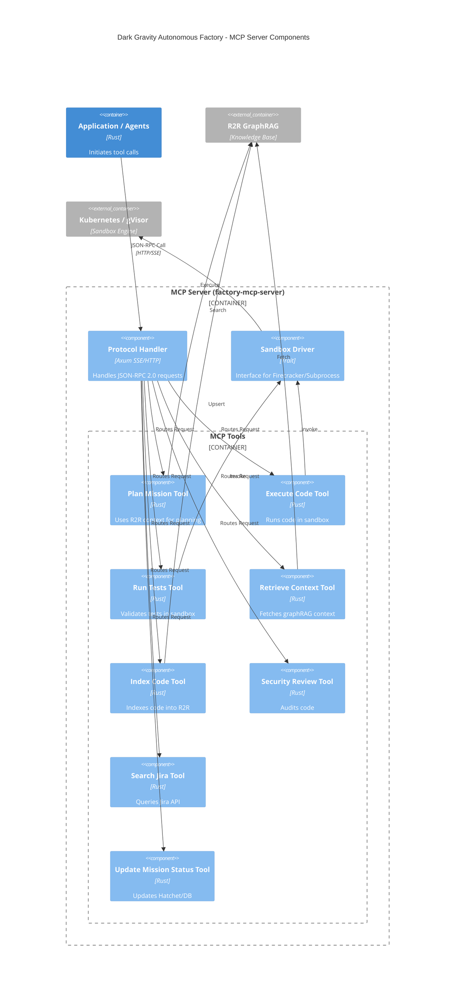
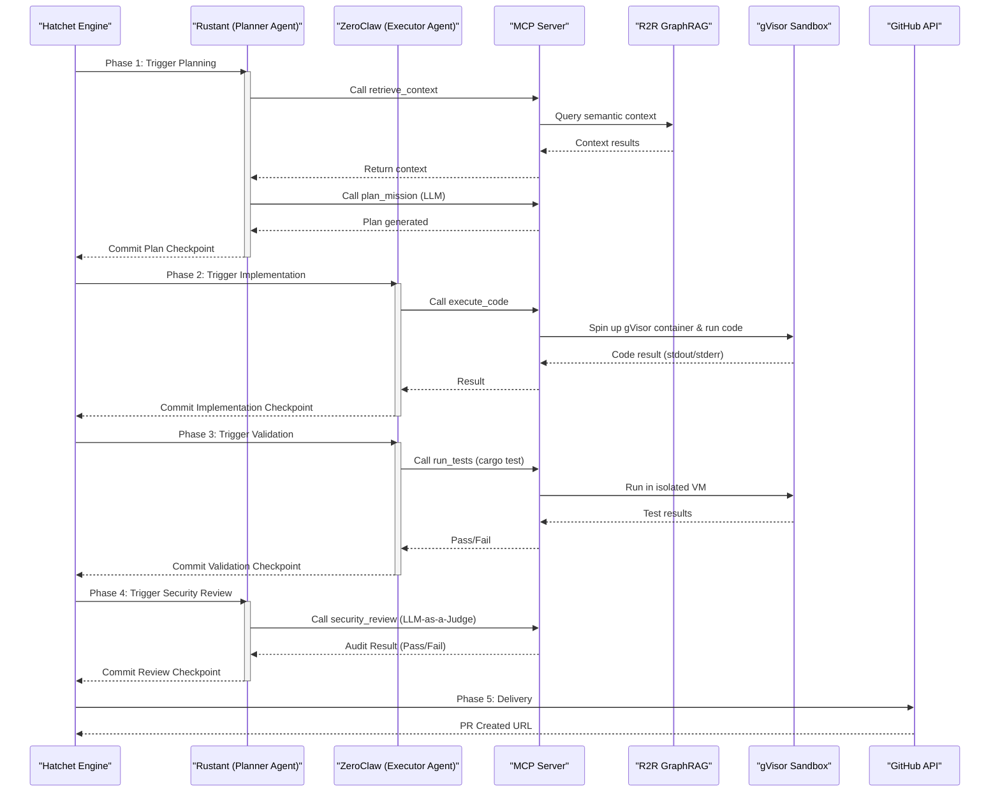
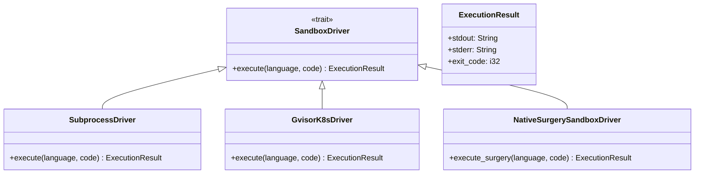

# TACTICAL-DESIGN: Dark Gravity Components

This document details the **Tactical Design** of the autonomous factory, mapping the domain logic to specific software components, crates, and data schemas.

---

## Workspace Components

| Crate | Layer | Responsibility |
| :--- | :--- | :--- |
| `factory-core` | **Domain** | Pure logic: `Mission`, `Task`, `MissionStatus`, `TaskStatus`, `SecurityValidator` trait, `SecurityBounds` trait, `FactoryError` |
| `factory-application` | **Application** | Hatchet Workflows (6-phase DAG), Agent Logic (Rustant, ZeroClaw) |
| `factory-infrastructure` | **Infrastructure** | Clients: Kafka, R2R GraphRAG, S3, Jira, OpenZiti, MCP, Vault |
| `factory-mcp-server` | **Interface** | Axum-based MCP Server with SSE/HTTP transport, 8 tools |
| `factory-cli` | **Interface** | Hatchet worker CLI entry point |

---

## CRG-Verified MCP Tool Inventory

Based on `code-review-graph` analysis of `factory-mcp-server/src/tools/`:

| Tool | File | Lines | Functions | Status |
| :--- | :--- | :--- | :--- | :--- |
| `plan_mission` | `tools/plan_mission.rs` | 19-85 | `new`, `name`, `description`, `input_schema`, `call` | Implemented |
| `execute_code` | `tools/execute_code.rs` | 12-64 | `new`, `name`, `description`, `input_schema`, `call` | Implemented |
| `run_tests` | `tools/run_tests.rs` | 12-63 | `new`, `name`, `description`, `input_schema`, `call` | Implemented |
| `retrieve_context` | `tools/retrieve_context.rs` | 12-56 | `new`, `name`, `description`, `input_schema`, `call` | Implemented |
| `index_code` | `tools/index_code.rs` | 11-80 | `new`, `name`, `description`, `input_schema`, `call` | Implemented |
| `security_review` | `tools/security_review.rs` | — | — | Implemented |
| `search_jira` | `tools/search_jira.rs` | 12-56 | `new`, `name`, `description`, `input_schema`, `call` | Implemented |
| `update_mission_status` | `tools/update_mission_status.rs` | — | — | Implemented |

Each tool implements the `Tool` trait with `name()`, `description()`, `input_schema()`, and `call()` methods.

### C4 Component Diagram: MCP Server



---

## Communication Patterns

### Inbound (Missions)
- **Adapter**: Confluent Kafka (`mission-input` topic).
- **Trigger**: Hatchet Engine observes Kafka stream.

### Internal (Agent Coordination)
- **Protocol**: MCP tools via `McpClient` (HTTP or SSE transport).
- **Mesh**: OpenZiti dark network overlay (mTLS) — zero public ports.
- **Memory**: R2R GraphRAG for semantic codebase context.
- **Telemetry**: Agent thoughts published to Kafka (`agent-thought` topic).

### Outbound (Delivery)
- **Adapter**: GitHub App (planned) via `create_pull_request`.
- **Protocol**: REST API.

---

## 6-Phase Hatchet DAG

The mission lifecycle is orchestrated by Hatchet Engine as a durable DAG:



---

## Data Model (factory-core)

```
Mission { id, name, description, created_at, tasks, status }
Task { id, mission_id, description, assigned_agent, dependencies, status }
MissionStatus: Pending | Running | Completed | Failed
TaskStatus: Queued | Active | Finished | Blocked
Metadata { timestamp, model_version, extra }
Inputs { jira_key, goal, target, constraints }
Outputs { pr_url, summary, artifact_paths }
Targets { agent_config, sandbox_config, expected_quality }
SHAPValues { values (HashMap) }
FeatureImportances { features (Vec) }
SecurityValidator: validate_signature() / audit_content() -> AuditResult
SecurityBounds: validate_token() / issue_jit_token() -> JitToken
VerifiableCredential: sign() / verify() (W3C JSON-LD with Ed25519)
```

---

## Sandbox Architecture



Both drivers are implemented in `crates/factory-mcp-server/src/sandbox.rs`.

---

## MCP Protocol

Communication follows the JSON-RPC 2.0 standard over SSE/HTTP, defined in `crates/factory-mcp-server/src/protocol.rs`:

- **`JsonRpcRequest`**: `{ id, method, params }`
- **`JsonRpcResponse`**: `{ id, result }`
- **`JsonRpcError`**: `{ code, message, data? }`
- **`McpTool`**: `{ name, description, input_schema }`
- **`CallToolResult`**: `{ content, is_error? }`
- **`McpContent`**: `{ type (text), text }`

---

*Last updated: 2026-07-08 — Verified against actual codebase via CRG analysis*