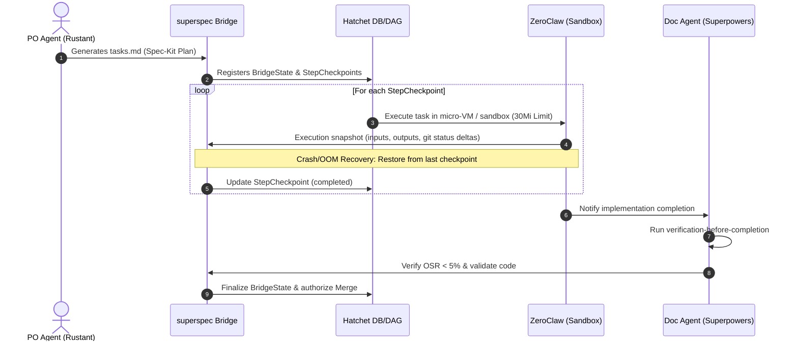

# 🛠️ TACTICAL-DESIGN: Dark Gravity Components

This document details the **Tactical Design** of the autonomous factory, mapping the domain logic to specific software components, crates, and data schemas.

## 1. Domain & Layer Mapping
The project follows **Domain-Driven Design (DDD)** and **Onion Architecture** across the following Rust workspace structure:

### Workspace Components
| Crate | Layer | Responsibility |
| :--- | :--- | :--- |
| `factory-core` | **Domain** | Pure logic: `Mission`, `Phase`, `AgentTask` |
| `factory-application` | **Application** | Hatchet Workflows, Agent Logic (`Rustant`, `ZeroClaw`) |
| `factory-infrastructure` | **Infrastructure** | Clients: `GitHub`, `MLflow`, `Kafka`, `R2R` |
| `factory-mcp-server` | **Interface** | MCP Server, SSE transport, and Skills |
| `factory-cli` | **Interface** | Tool execution and local debugging |

---

## 2. MLOps Lifecycle
Every mission is managed as a **MLflow Experiment**. Metrics tracked include:
- `remediation_success`: Binary (0/1) for successful delivery.
- `commit_latency`: Time from code change to PR creation.
- `resource_usage`: CPU/Memory consumption of the sandbox.
- `token_cost`: Financial cost via LiteLLM telemetry.

---

## 3. Communication Patterns

### Inbound (Missions)
- **Adapter**: `n8n` or custom poller.
- **Protocol**: HTTP/Webhooks mapped to internal **Kafka** topics.
- **Trigger**: Hatchet Engine observes the Kafka stream.

### Internal (Agent Coordination & Superspec Bridge)
- **Protocol**: SSE/RPC via the MCP Server.
- **Persistence**: **SurrealDB** for tracking session state and tracking IDs.
- **Telemetry**: Real-time thoughts published to **Kafka** (Agent-Thought-Stream).

#### 🌉 The Superspec Orchestration Bridge
The `superspec` component acts as the bridge orchestrating execution state between planning (**Spec-Kit**) and execution/verification (**Superpowers**).
- **Bridge State & Checkpoints**: `superspec` transforms plan tasks (`tasks.md`) into a state machine composed of sequential `StepCheckpoint`s on Hatchet's durable DAG database.
- **Resilience & Recovery**: If a worker pod crashes or suffers an Out-Of-Memory (OOM) error, `superspec` restores execution exactly from the last validated `StepCheckpoint`. This prevents infinite execution loops, conserving token usage and GPU compute cycles in the LiteLLM gateway.

### Outbound (Delivery)
- **Adapter**: `HttpGitHubClient` (App Auth).
- **Protocol**: REST + `workflow_dispatch`.

---

## 4. LLM Component Interactions & FinOps Gateway

- **Orchestrator**: Hatchet (Durable Task Graph) coordinating jobs.
- **Core LLM**: LiteLLM (minimax-m2.7:cloud).
- **Vector Store**: R2R Graph RAG.
- **Guardrails**: Integrated into the **Verification Triad**.

### 🪙 Predictive FinOps & Vtags
To achieve total budget attribution and cost control in the multi-agent execution environment:
- **Virtual Tags (Vtags)**: Every request sent to the LiteLLM gateway has a `FinOpsTag` metadata header injected. This header categorizes the request by Epic, Team, and Microservice for real-time cost tracking.
- **Predictive Circuit Breakers**: Rather than static budget cuts (e.g., stopping at 90%), the FinOps engine monitors **token velocity** (consumption speed). If a trend forecast indicates that a task will deplete its budget before completion, it fires warning events or trips the circuit breaker to prevent wasteful agent looping.
