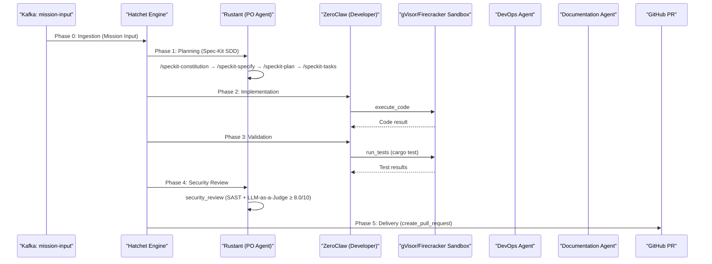

# TACTICAL-DESIGN: Dark Gravity Components

This document details the **Tactical Design** of the autonomous factory, mapping the domain logic to specific software components, crates, and data schemas.

---

## Workspace Components

| Crate | Layer | Responsibility |
| :--- | :--- | :--- |
| `factory-core` | **Domain** | Pure logic: `Mission`, `Task`, `MissionStatus`, `TaskStatus`, `SecurityValidator` (Ed25519 NHI), `FactoryError` |
| `factory-application` | **Application** | Hatchet Workflows (6-phase DAG), Agent Logic (Rustant, ZeroClaw, DevOps, Documentation) |
| `factory-infrastructure` | **Infrastructure** | Clients: Kafka (`rdkafka`), R2R GraphRAG, S3 (AWS SDK), Jira (HTTP), OpenZiti, Sentry, GitHub |
| `factory-mcp-server` | **Interface** | Axum-based MCP Server with SSE transport, 9+ tools |
| `factory-cli` | **Interface** | Hatchet worker CLI entry point |

---

## 6-Phase Hatchet DAG

The mission lifecycle is orchestrated by Hatchet Engine as a durable DAG:



---

## MCP Tool Inventory

| Tool | File | Input | Output | Status |
| :--- | :--- | :--- | :--- | :--- |
| `plan_mission` | `tools/plan_mission.rs` | `{mission_id, epic_description, r2r_context}` | `{spec_md, plan_md, tasks_md}` | Done |
| `execute_code` | `tools/execute_code.rs` | `{code, language, sandbox_driver}` | `ExecutionResult` | Done |
| `run_tests` | `tools/run_tests.rs` | `{workspace_path, test_filter}` | `{passed, failed, output}` | Done |
| `retrieve_context` | `tools/retrieve_context.rs` | `{query, module_path, max_tokens}` | `{context_chunks[]}` | Done |
| `index_code` | `tools/index_code.rs` | `{git_diff, repository}` | `{indexed_symbols}` | Done |
| `security_review` | `tools/security_review.rs` | `{diff, llm_judge_model}` | `{score, findings[]}` | Done |
| `search_jira` | `tools/search_jira.rs` | `{jql_query}` | `{issues[]}` | Done |
| `update_mission_status` | `tools/update_mission_status.rs` | `{mission_id, status, message}` | `{updated: bool}` | Done |
| `spec_kit_tool` | `tools/spec_kit_tool.rs` | `{command, feature_name, epic_context}` | `{artifacts_path, stdout}` | Done |

---

## Communication Patterns

### Inbound (Missions)
- **Adapter**: Confluent Kafka (`mission-input` topic).
- **Protocol**: Protobuf schemas compiled via `prost` + `tonic-build`.
- **Trigger**: Hatchet Engine observes Kafka stream.

### Internal (Agent Coordination)
- **Protocol**: MCP tools via `McpHttpClient` / `McpSseClient` (SSE handshake).
- **Mesh**: OpenZiti dark network overlay (mTLS 1.3) — zero public ports.
- **Memory**: R2R GraphRAG backed by pgvector (CloudNativePG PostgreSQL 16).
- **Telemetry**: Agent thoughts published to Kafka (`agent-thought` topic).

### Outbound (Delivery)
- **Adapter**: GitHub App (RSA JWT auth) via `create_pull_request` MCP tool.
- **Protocol**: REST API.

---

## Superspec Bridge

The **superspec** orchestrator bridges Spec-Kit (planning) with Superpowers (execution):

1. **State Transfer**: Parses `tasks.md` → `BridgeState` with `StepCheckpoint` checklist.
2. **Durable Checkpointing**: Workers post execution snapshots (inputs/outputs, git deltas) back to `superspec` API.
3. **Crash Recovery**: Hatchet restarts workflow step → `superspec` reads persisted `BridgeState` → resumes from first uncompleted checkpoint.
4. **Validation Feedback**: `verification-before-completion` OSR check results feed back into Spec-Kit cycle.

---

## Data Model (factory-core)

```
Mission { id, name, description, created_at, tasks, status }
Task { id, mission_id, description, assigned_agent, dependencies, status }
MissionStatus: Pending | Running | Completed | Failed
TaskStatus: Queued | Active | Finished | Blocked
Metadata { timestamp, model_version, extra }
SecurityValidator: validate_signature() / audit_content() (Ed25519)
```

---

## MLOps & Governance

| Capability | Tooling | Purpose |
| :--- | :--- | :--- |
| Semantic Memory | R2R GraphRAG + pgvector | Codebase context for agents |
| FinOps | StackSpend/Finout (Vtags) | Per-Epic LLM cost attribution |
| Error Tracking | Sentry + Closed-Loop QA | Auto-generate backlog from production errors |
| Documentation Quality | OSR (Orphan Symbol Rate) | Quantified Wiki accuracy gate < 5% |
| Compliance | NHI Verifiable Credentials | SOC 2 & EU AI Act audit trails |
| R&D Grants | Hazitek/SPRI Packager | Auto-compile grant documentation |
