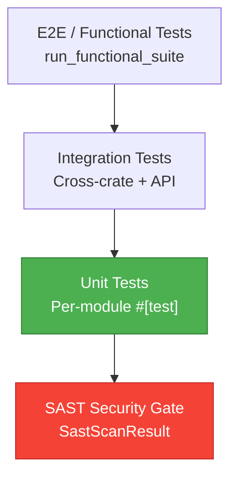

# Test Plan & Report — Dark Gravity Factory

> **Purpose**: Test strategy covering unit, integration, functional, and SAST security testing.

---

## Test Pyramid



## Crate Test Coverage

| Crate | Unit Tests | Integration | SAST |
|:---|:---:|:---:|:---:|
| `factory-core` | ✅ | — | — |
| `factory-application` | ✅ | ✅ | ✅ |
| `factory-infrastructure` | ✅ | ✅ | — |
| `factory-mcp-server` | ✅ | ✅ | ✅ |
| `factory-cli` | ✅ | — | — |

## Commands

```bash
# Run all tests
cargo test --workspace

# Run with coverage
cargo llvm-cov --workspace --html

# Run functional suite
cargo run --bin run_functional_suite
```

---

> *Related: [Verification Triad](VERIFICATION-TRIAD.md) · [QAObserverAgent](crates_factory-application_src_agents_qa_observer.md)*
