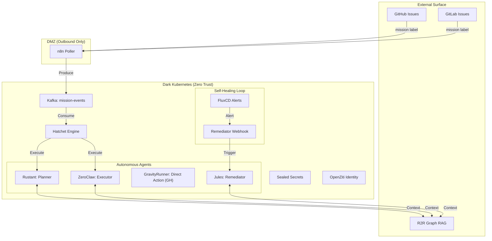
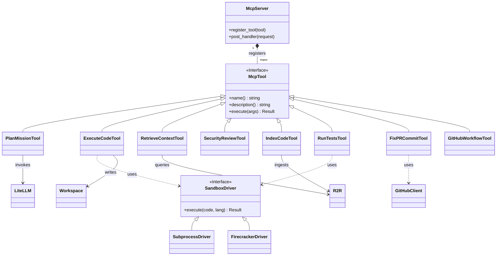

# 🏗️ Architecture: Dark Gravity CA/CD

## 🛡️ Zero Trust Architecture (ZTA)

The system operates strictly within a **Zero Trust** perimeter. No inbound traffic is allowed, and all outbound traffic to external APIs (GitHub, GitLab) is strictly governed by **OpenZiti** and Kubernetes **NetworkPolicies**.

### 🛠️ High-Level System Diagram

---

## 🏗️ Rust Workspace Components (DDD Layers)

The codebase follows the **Domain-Driven Design (DDD)** pattern, separating concerns into four logic layers. This ensures the **LLMOps** lifecycle—from mission planning to production-ready deployment—is both modular and resilient.

| Crate | DDD Layer | Responsibility | Key Dependencies |
| :--- | :--- | :--- | :--- |
| `factory-core` | **Domain** | Pure business logic, shared models, and security protocols. | `serde`, `uuid` |
| `factory-application` | **Application** | Hatchet orchestration via **6-Phase DAG**. Specialized workers: **Rustant**, **ZeroClaw**, and **GravityRunner**. | `factory-core` |
| `factory-infrastructure` | **Infrastructure** | Concrete adapters for **GitHub (App)**, **GitLab**, **R2R**, and **LiteLLM**. | `reqwest`, `rdkafka`, `jsonwebtoken` |
| `factory-mcp-server` | **Interface (RPC)** | MCP Server, **SSE transport**, and integrated Skills (Context, Sandbox). | `axum`, `tokio` |
| `factory-cli` | **Interface (CLI)** | Command-line entry points for workers and local testing. | `clap` |

### 🧩 DDD Pattern Application
- **Domain**: Ownership of core logic (PR status, Commit integrity). Framework-agnostic.
- **Application**: The "Orchestrator" (Hatchet Workflows, Agent Logic).
- **Infrastructure**: The "Adapters" (GitHub Apps, Kafka Producers, Firecracker micro-VMs).
- **Interface**: The "Entrypoints" (CLI, MCP Server, SSE Stream).

---

## 🛠️ MCP Server & Tooling Lifecycle (LLMOps)

The `factory-mcp-server` is the "Hands" of the factory. It provides a standardized interface for agents to interact with the cluster and external services, Closing the loop in the **LLMOps** lifecycle.

### Key Tools

1. **PlanMissionTool**: Uses LLM to decompose high-level goals into a Directed Acyclic Graph (DAG) of tasks.
2. **ExecuteCodeTool**: Generates and executes code via a `SandboxDriver` (Local subprocess or Firecracker).
3. **RetrieveContextTool**: Connects to the R2R Graph RAG system to fetch relevant code patterns.
4. **SecurityReviewTool**: Analyzes code for vulnerabilities and architectural violations.
5. **IndexCodeTool**: Ingests new code or documentation into R2R to close the feedback loop.
6. **RunTestsTool**: Specialized tool for executing test suites (cargo test, pytest) with structured feedback.

---

## 🔐 Security & Governance

- **OIDC Authentication**: All user access to **OpenWebUI** and **LiteLLM** is federated via Keycloak.
- **Sealed Secrets**: API tokens (GitHub, GitLab, LiteLLM) are NEVER stored in plain text. They are encrypted using the **Bitnami Sealed Secrets** controller before being committed to GitOps.
- **Micro-segmentation**: Only the `n8n` pods have internet egress. Agents are strictly internal-only.
