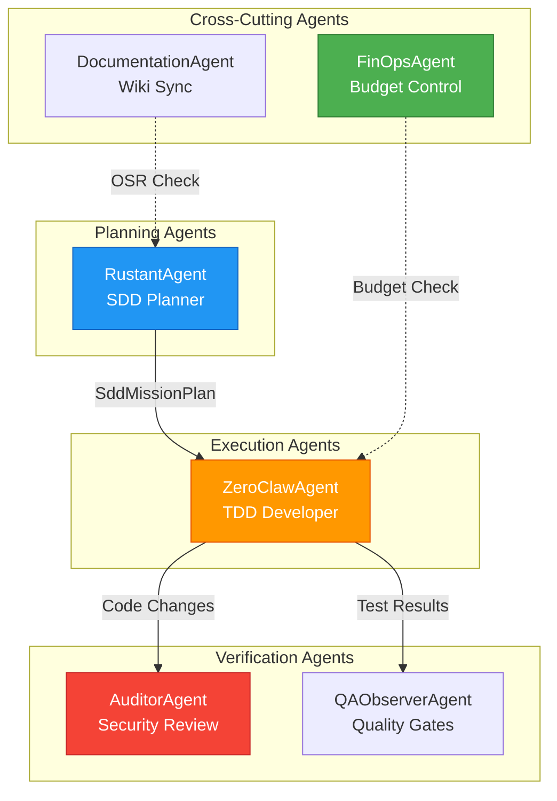

# Agent Specifications — Dark Gravity CA/CD Autonomous Factory

> **Purpose**: Consolidated specification of all 6 factory agents with shared trait interface, behavioral descriptions, tool authorization, and comparative analysis.

---

## 1. Agent Trait Interface

All agents implement the shared `Agent` trait defined in `factory-application/src/lib.rs`:

```mermaid
classDiagram
    class Agent {
        <<trait>>
        +name() String
        +execute(task_description) Result~Value~
    }

    class RustantAgent {
        -Arc~McpClient~ mcp_client
        -Arc~R2rClient~ r2r_client
        +plan_mission(mission_id, goal) Result~Value~
        +review_mission(mission_id, results) Result~Value~
        +parse_sdd_tasks(content)$ Vec~SddTaskItem~
    }

    class ZeroClawAgent {
        -Arc~McpClient~ mcp_client
        -Arc~AethalgardClient~ aethalgard_client
        +execute_task(mission_id, description, files) Result~Value~
        +execute_tdd_task(mission_id, task) Result~Value~
        +validate_mission(mission_id, test_command) Result~Value~
        +introspect_k8s(mission_id) Result~Value~
        +validate_sandbox_constraints(app, sidecar)$ Result
    }

    class AuditorAgent {
        +analyze_dag_logs(mission_id) Result~Vec~Value~~
        +audit_mission(mission_id, failures) Result~Value~
        +evaluate_prompts(mission_id, targets, recs) Result~String~
    }

    class FinOpsAgent {
        -String litellm_base_url
        -String api_key
        -Client client
        -FinOpsTag tag
        +inject_vtags(request) RequestBuilder
        +evaluate_spend_delta(current, previous, max) BudgetEvaluation
        +dispatch_budget_exceeded_event(kafka, mission, spend, max) Result
        +monitor_budget() Result
    }

    class QAObserverAgent {
        +observe_quality(mission_id) Result~Value~
    }

    class DocumentationAgent {
        +generate_wiki(mission_id) Result~Value~
        +calculate_osr(mission_id) Result~OsrMetric~
    }

    Agent <|.. RustantAgent
    Agent <|.. ZeroClawAgent
    Agent <|.. AuditorAgent
    Agent <|.. FinOpsAgent
    Agent <|.. QAObserverAgent
    Agent <|.. DocumentationAgent
```

---

## 2. Agent Behavioral Specifications

### RustantAgent — Strategic Planner

| Attribute | Value |
|:---|:---|
| **Role** | Mission planner: decomposes goals into Spec-Kit SDD task sequences |
| **DAG Phase** | Phase 2 (Plan) + Phase 5 (Review) |
| **Dependencies** | `McpClient` (MCP tools), `R2rClient` (GraphRAG context) |
| **Key Flow** | R2R context retrieval → 6-phase Spec-Kit sequence → Parse `tasks.md` → Emit `SddMissionPlan` |
| **SDD Phases** | `init` → `specify` → `plan` → `execute` → `verify` → `git-commit` |

### ZeroClawAgent — TDD Developer

| Attribute | Value |
|:---|:---|
| **Role** | Code developer: executes tasks in gVisor sandboxes with TDD discipline |
| **DAG Phase** | Phase 3 (Code) + Phase 4 (Validation) |
| **Dependencies** | `McpClient` (sandbox tools), `AethalgardClient` (circuit breaker) |
| **Key Flow** | Load checkpoint → SAST pre-scan → Sandbox execution → TDD Red/Green → Validation |
| **Circuit Breaker** | 3 retries max; escalates to Aethalgard on stagnant diff hash |

### AuditorAgent — Security & Quality Auditor

| Attribute | Value |
|:---|:---|
| **Role** | Audits DAG failures, generates recommendations, optimizes agent prompts |
| **DAG Phase** | Phase 5 (Review) |
| **Dependencies** | Hatchet API (failure logs), LiteLLM (analysis), `async-openai` |
| **Key Flow** | Fetch failed DAG logs → LLM analysis → Generate recommendations → Prompt engineering loop |
| **FinOps Tags** | `x-vtags-team: dark-gravity-ops`, `x-vtags-epic: E6.3` |

### FinOpsAgent — Financial Operations

| Attribute | Value |
|:---|:---|
| **Role** | Monitors LLM token spend, enforces budget limits, detects anomalies |
| **DAG Phase** | Cross-cutting (runs continuously) |
| **Dependencies** | LiteLLM spend API, `KafkaClient` (budget events) |
| **Key Flow** | Poll LiteLLM `/spend/logs` → Evaluate spend delta → Alert/Hardstop |
| **Thresholds** | Velocity: > $1.00/min → Alert; 90% of daily budget → Hardstop |

### QAObserverAgent — Quality Assurance

| Attribute | Value |
|:---|:---|
| **Role** | Monitors test coverage, enforces quality gates |
| **DAG Phase** | Phase 4 (Validation) |

### DocumentationAgent — Wiki Generator

| Attribute | Value |
|:---|:---|
| **Role** | Generates wiki content, calculates OSR, triggers doc-sync |
| **DAG Phase** | Phase 6 (Delivery) |
| **Quality Gate** | OSR < 5% (all public AST symbols documented) |

---

## 3. Tool Authorization Matrix

| Tool | Rustant | ZeroClaw | Auditor | FinOps | QA | Doc |
|:---|:---:|:---:|:---:|:---:|:---:|:---:|
| `plan_mission` | ✅ | ❌ | ❌ | ❌ | ❌ | ❌ |
| `invoke_spec_kit` | ✅ | ❌ | ❌ | ❌ | ❌ | ❌ |
| `security_review` | ✅ | ✅ | ❌ | ❌ | ❌ | ❌ |
| `launch_sandbox_pod` | ❌ | ✅ | ❌ | ❌ | ❌ | ❌ |
| `execute_code` | ❌ | ✅ | ❌ | ❌ | ❌ | ❌ |
| `run_tests` | ❌ | ✅ | ❌ | ❌ | ❌ | ❌ |
| `sync_bridge_state` | ❌ | ✅ | ❌ | ❌ | ❌ | ❌ |
| `introspect_k8s` | ❌ | ✅ | ❌ | ❌ | ❌ | ❌ |
| `retrieve_context` | ✅ | ❌ | ❌ | ❌ | ❌ | ✅ |
| `search_jira` | ✅ | ❌ | ❌ | ❌ | ❌ | ❌ |

---

## 4. Comparative Behavioral Matrix

---

> *Related: [Tactical Design](tactical_design.md) · [Experiment Lifecycle](runtime_sequences.md)*