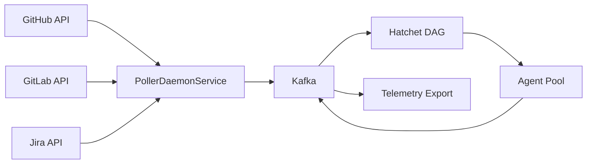
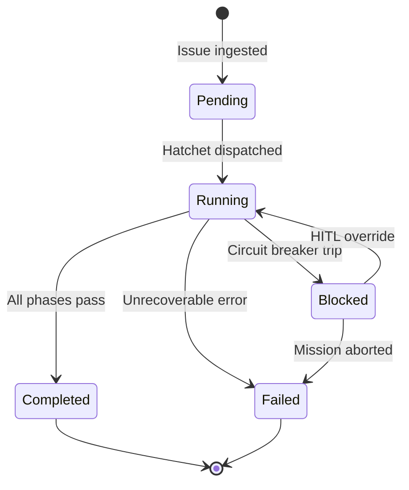

# Mission Data Model — Event-Driven Architecture

> **Purpose**: Mission lifecycle data model and event-driven architecture flow.

---

## Event-Driven Architecture

## Mission State Machine

---

> *Related: [Experiment Lifecycle](runtime_sequences.md) · [lib.rs](../modules/core/lib.md)*
