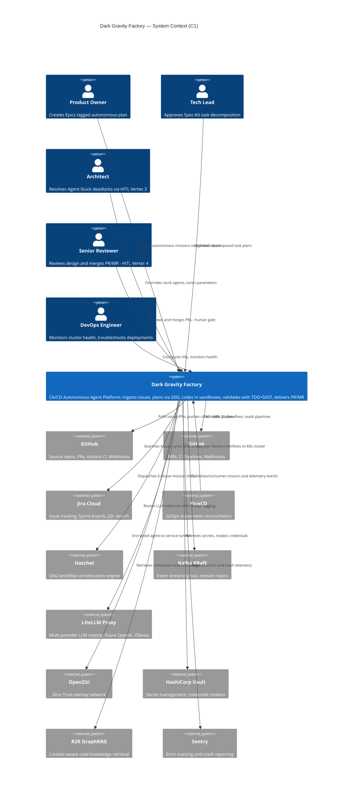
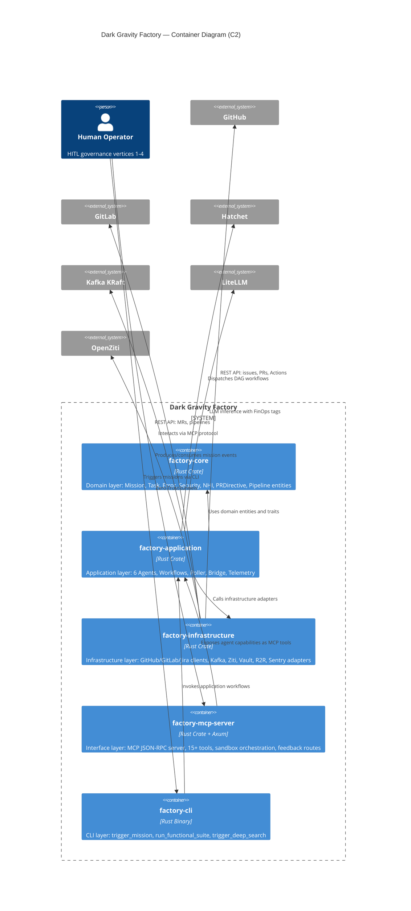
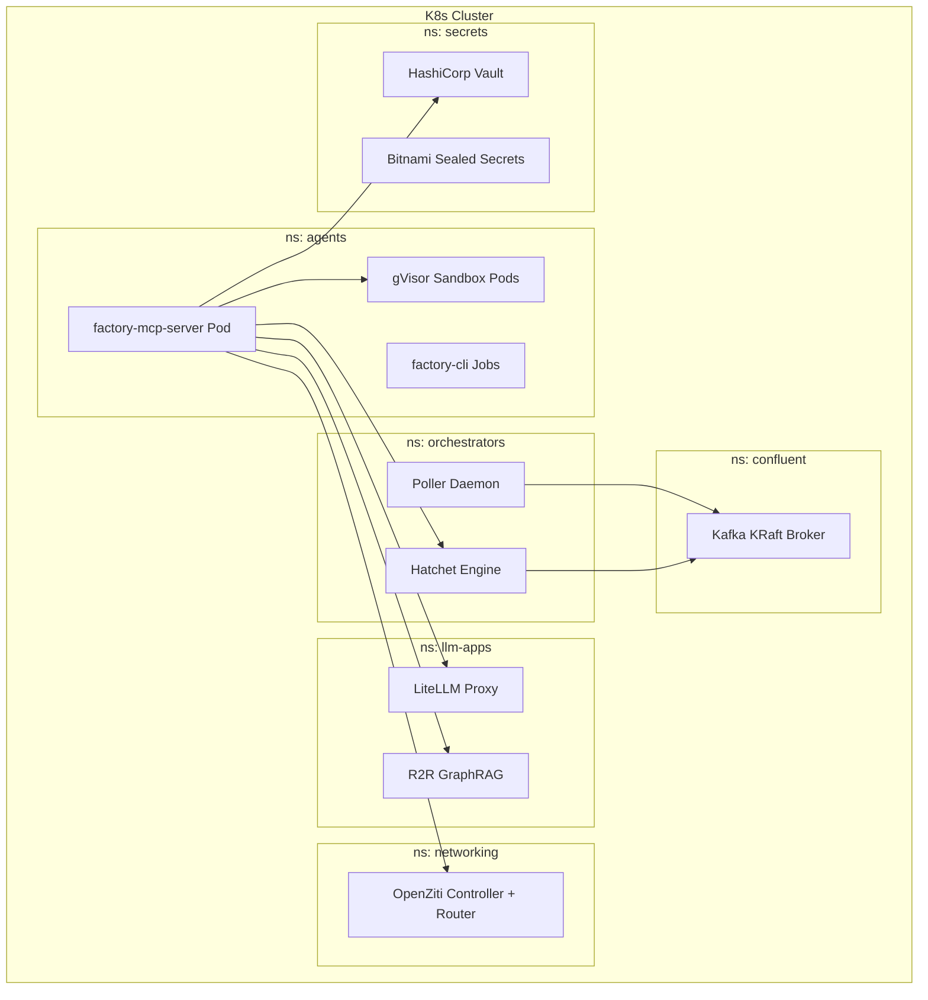
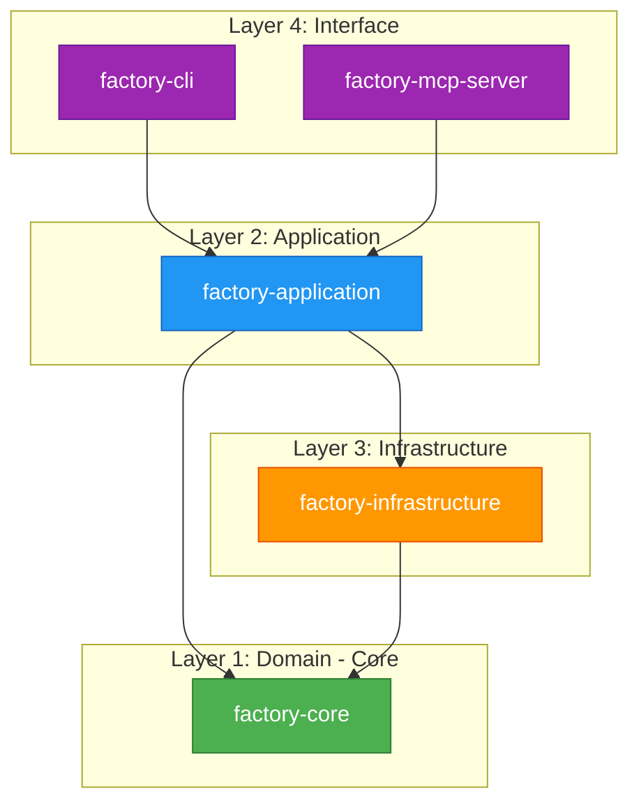
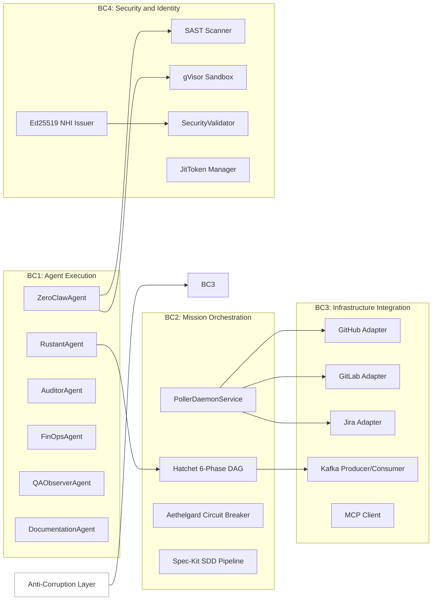

# Strategic Design — Dark Gravity CA/CD Autonomous Factory

> **Purpose**: Present the top-down architectural view using C4 model levels 1–2, Onion Architecture layering, and Bounded Context mapping.

---

## 1. C4 Level 1: System Context Diagram

The System Context diagram shows the Dark Gravity Factory as a single system interacting with human actors and external systems.

---

## 2. C4 Level 2: Container Diagram

The Container diagram decomposes the factory into its 5 Rust crates (deployable containers) and their Kubernetes namespace topology.

### Kubernetes Namespace Topology

---

## 3. Onion Architecture Layer Model

The factory follows a strict **Onion Architecture** where dependencies point inward. No inner layer references an outer layer.

| Layer | Crate | Responsibility | Dependencies |
|:---|:---|:---|:---|
| **Domain (Core)** | `factory-core` | Entities (`Mission`, `Task`, `PRDirective`), Error types, Security traits, NHI credentials | `serde`, `chrono`, `uuid`, `thiserror`, `ed25519-dalek`, `zeroize` |
| **Application** | `factory-application` | Agents (`Rustant`, `ZeroClaw`, etc.), Workflows, Poller, Bridge, Telemetry | `factory-core`, `factory-infrastructure`, `async-trait`, `regex` |
| **Infrastructure** | `factory-infrastructure` | Platform adapters: GitHub, GitLab, Jira, Kafka, Ziti, Vault, R2R, Sentry, MCP Client | `factory-core`, `reqwest`, `rdkafka`, `kube`, `k8s-openapi` |
| **Interface (MCP)** | `factory-mcp-server` | MCP JSON-RPC server, tool registration, sandbox pod management, feedback routes | `factory-core`, `factory-application`, `factory-infrastructure`, `axum`, `tower` |
| **Interface (CLI)** | `factory-cli` | Binary entry points: `trigger_mission`, `run_functional_suite`, `trigger_deep_search` | `factory-core`, `factory-application`, `clap`, `tokio` |

---

## 4. Bounded Context Map

The factory decomposes into 4 strategic bounded contexts with explicit integration patterns:

### Context Integration Patterns

| Source BC | Target BC | Pattern | Mechanism |
|:---|:---|:---|:---|
| Agent Execution → Infrastructure | Anti-Corruption Layer | Agents call infrastructure adapters via trait abstractions (`McpClient`, `R2rClient`, `AethalgardClient`) |
| Mission Orchestration → Agent Execution | Published Events | Hatchet DAG dispatches task events consumed by agents |
| Mission Orchestration → Infrastructure | Shared Kernel | `PolledIssueEvent`, `PRCommentEvent` domain entities shared between poller and adapters |
| Security/Identity → All | Conformist | All contexts conform to `SecurityValidator` trait and `SandboxConstraint` policies |

---

> *Related: [Business Context](business_context.md) · [Tactical Design](tactical_design.md) · [Agent Specifications](agent_specifications.md)*