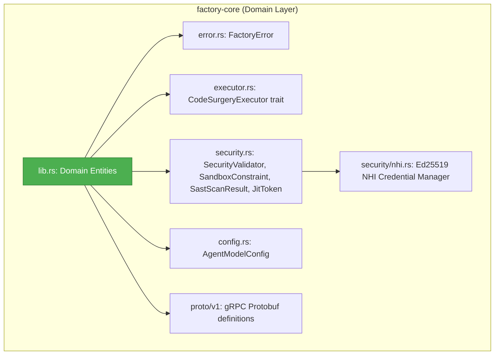
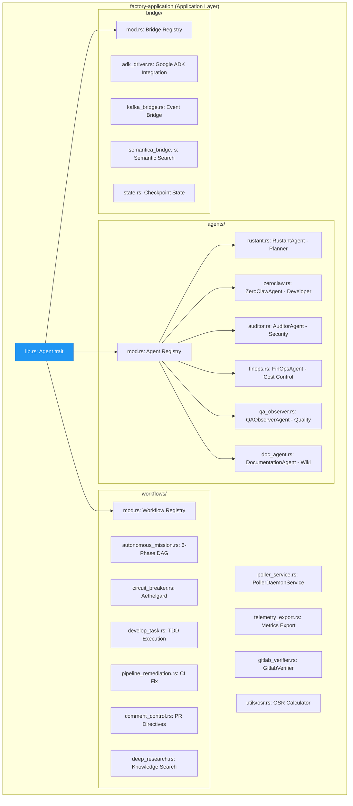
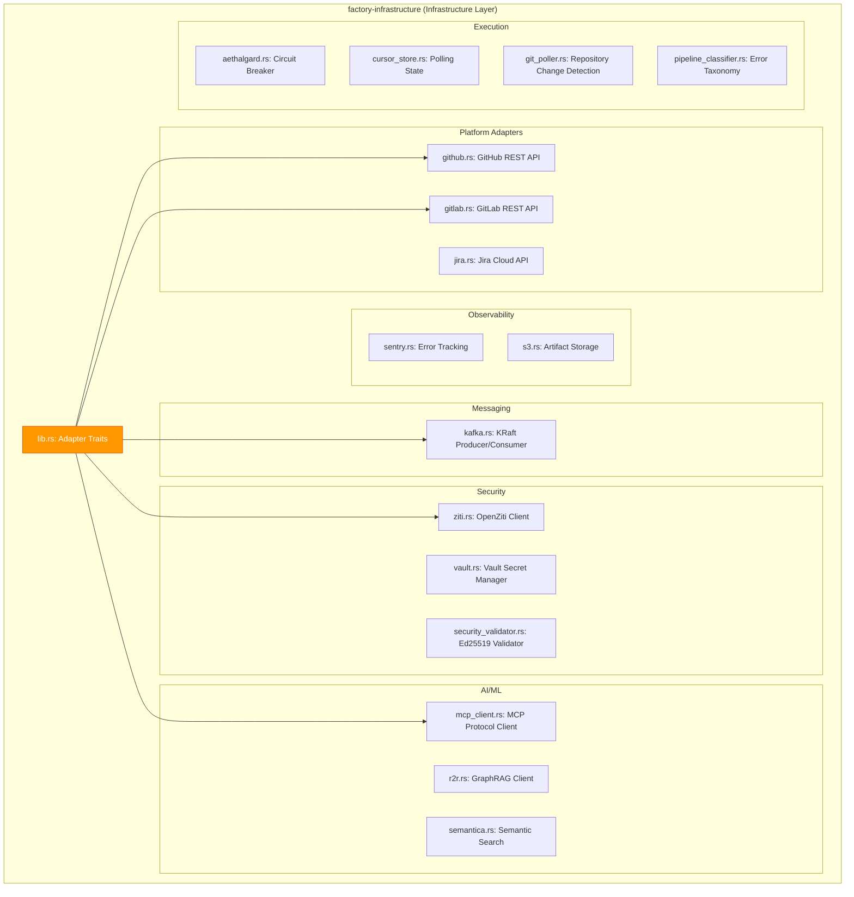
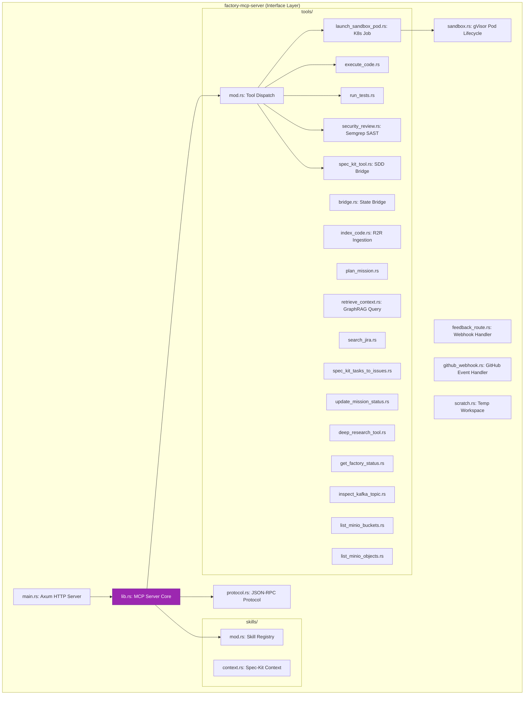
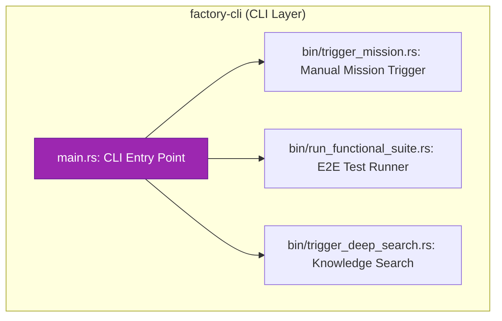

# Tactical Design — Dark Gravity CA/CD Autonomous Factory

> **Purpose**: C4 Level 3 (Component) diagrams showing internal components per crate, module dependencies, DAG phase mapping, and MCP tool registry.

---

## 1. C4 Level 3: Component Diagrams

### 1.1 factory-core Components

**Key domain entities in `lib.rs`**:

| Entity | Description |
|:---|:---|
| `Mission` | Complete unit of autonomous work with `id`, `tasks`, `status` |
| `Task` | Individual work unit with `assigned_agent`, `dependencies`, `status` |
| `PRDirective` | Parsed bot command: `Spec`, `Refine`, `Retry`, `Status`, `Validate`, `Interact` |
| `PolledIssueEvent` | Issue detected by outbound poller |
| `PRCommentEvent` | PR comment with extracted directive |
| `PipelineFailureEvent` | CI/CD failure for remediation |
| `ErrorCategory` | Classification: `CodeCompilation`, `LintViolation`, `TestFailure`, etc. |
| `FinOpsTag` | Cost attribution virtual headers |
| `SddMissionPlan` | Structured plan from RustantAgent for Hatchet |
| `SddTaskItem` | Individual SDD task parsed from `tasks.md` |

---

### 1.2 factory-application Components

---

### 1.3 factory-infrastructure Components

---

### 1.4 factory-mcp-server Components

---

### 1.5 factory-cli Components

---

## 2. DAG Phase-to-Agent Mapping

The 6-phase Hatchet DAG maps each phase to its responsible agent:

| Phase | Agent | Input | Output | HITL Gate |
|:---|:---|:---|:---|:---|
| **1. Ingestion** | PollerDaemonService | Issue/PR/Pipeline event | `PolledIssueEvent` or `PRCommentEvent` | Vertex 1 (PO creates Epic) |
| **2. Plan** | RustantAgent | Event + R2R context | `SddMissionPlan` with tasks | Vertex 2 (Tech Lead approves) |
| **3. Code** | ZeroClawAgent | `SddTaskItem` list | Code patches in sandbox | — |
| **4. Validation** | ZeroClawAgent + AuditorAgent | Code patches | Test results + SAST scan | Vertex 3 (Architect on deadlock) |
| **5. Review** | RustantAgent | Validation results | Review decision | — |
| **6. Delivery** | PollerDaemonService | Approved changes | PR/MR creation | Vertex 4 (Reviewer merges) |

---

## 3. MCP Tool Registry

The `factory-mcp-server` exposes 15+ MCP tools:

| Tool | Category | Description |
|:---|:---|:---|
| `launch_sandbox_pod` | Execution | Creates gVisor-sandboxed K8s pod |
| `execute_code` | Execution | Runs code in sandbox |
| `run_tests` | Validation | Executes test suites |
| `security_review` | Security | SAST scan via Semgrep |
| `spec_kit_tool` | Planning | Spec-Kit SDD bridge |
| `spec_kit_tasks_to_issues` | Planning | Converts tasks to GitHub issues |
| `plan_mission` | Planning | Generates mission plan |
| `retrieve_context` | Knowledge | R2R GraphRAG query |
| `index_code` | Knowledge | Ingests code into R2R |
| `search_jira` | Integration | JQL issue search |
| `bridge` | State | Checkpoint state management |
| `update_mission_status` | Telemetry | Mission status tracking |
| `deep_research_tool` | Knowledge | Deep web/code research |
| `get_factory_status` | Observability | Factory health check |
| `inspect_kafka_topic` | Observability | Kafka topic inspection |

---

> *Related: [Strategic Design](strategic_design.md) · [Agent Specifications](agent_specifications.md) · [Experiment Lifecycle](runtime_sequences.md)*