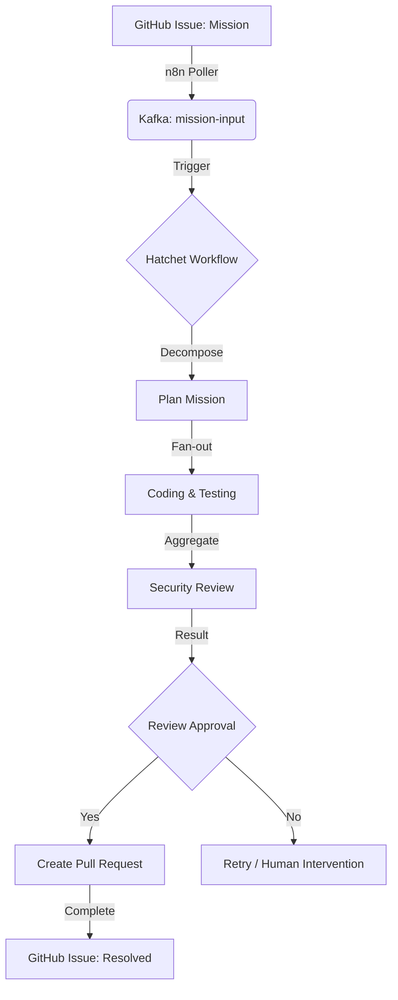

# 🏭 Business Understanding: Dark Gravity CA/CD

## 🎯 Goal Description

Deploy a high-fidelity **Autonomous Agent Workforce** inside a Zero Trust Kubernetes cluster. This factory uses **OpenWebUI** for mission input and **Hatchet** as the durable backbone to orchestrate **OpenCode** workers.

### 💼 Problem Statement

In air-gapped or restricted (Zero Trust) environments, manual code development, testing, and deployment cycles are slow and prone to errors. Security requirements often create bottlenecks that prevent rapid iteration.

**Dark Gravity** solves this by:

- **Automating the Lifecycle**: From a GitHub Issue to a verified Pull Request.
- **Ensuring Zero Trust**: All agents run with OpenZiti identities and strict Network Policies.
- **Secure Sandboxing**: High-risk code execution occurs in Firecracker MicroVMs.

---

## 📈 ROI & Key Performance Indicators (KPIs)

| KPI | Metric | Target |
| :--- | :--- | :--- |
| **Cycle Time** | Time from GitHub Issue "mission" to PR creation | < 60 minutes |
| **Test Coverage** | Percentage of missions resulting in increased coverage | > 95% |
| **Success Rate** | Percentage of PRs merged without human intervention | > 70% |
| **Security Compliance** | Zero critical vulnerabilities in generated code | 100% |

---

## 🔄 Mission Lifecycle Flow

The following lifecycle represents the path of a single mission (e.g., "Add user authentication to the API").

### 1. Ingestion (Outbound Polling)
Since the cluster is **Zero Trust** (no inbound internet), an outbound `n8n` poller proactively fetches labeled issues (e.g., `label:"mission"`) from GitHub/GitLab and publishes them to an internal Kafka topic.

### 2. Durable Orchestration
**Hatchet** acts as the "Brain," ensuring that every mission is durable. If a node fails or an API call times out, Hatchet retries the specific step, preserving the entire workflow's state.

### 3. Verification & Guardrails
No code reaches the `main` branch without passing through a multi-agent verification loop:
- **Coder Agent**: Generates the code.
- **Tester Agent**: Validates functionality in a sandbox.
- **Reviewer Agent**: Checks for security and architectural alignment.

---

## 🛡️ Strategic Alignment

> [!IMPORTANT]
> This architecture is designed to **eliminate redundant management layers** and promote **Hatchet** to the primary orchestrator. It uses established infrastructure like **CloudNativePG** and **RabbitMQ** for maximum reliability.
