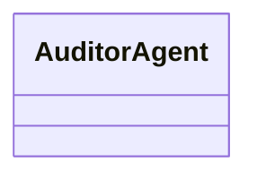
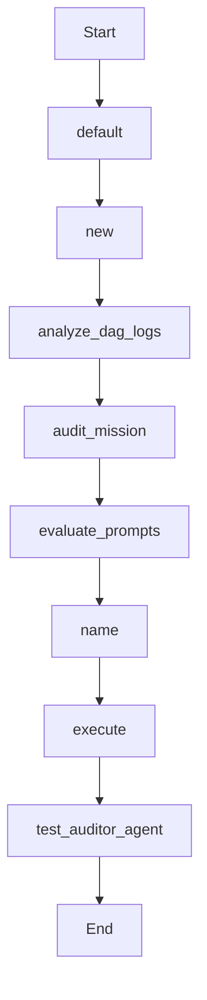

# auditor.rs

Source File: `crates/factory-application/src/agents/auditor.rs`

## Component Architecture

```mermaid
classDiagram
    class AuditorAgent
```

## Execution Flow

```mermaid
flowchart TD
    Start --> default
    default --> new
    new --> analyze_dag_logs
    analyze_dag_logs --> audit_mission
    audit_mission --> evaluate_prompts
    evaluate_prompts --> name
    name --> execute
    execute --> test_auditor_agent
    test_auditor_agent --> End
```
