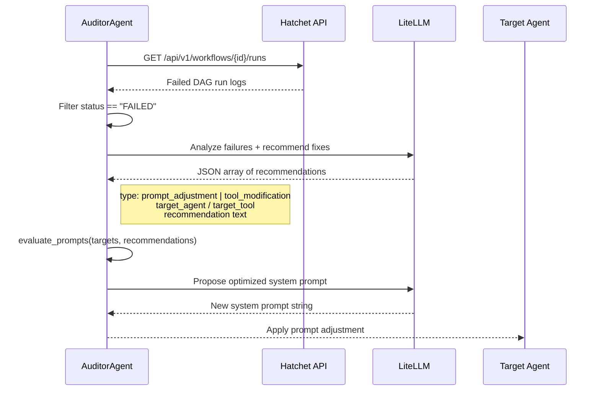

# factory-application::agents::auditor — AuditorAgent

> **Source**: `crates/factory-application/src/agents/auditor.rs`
> **Layer**: Application

---

## Security Review Flow

## SAST Gate Integration

The AuditorAgent coordinates with `SastScanResult` to enforce the security gate:

| Check | Gate Threshold |
|:---|:---|
| SAST Score | >= 8.0 / 10.0 |
| Critical Vulnerabilities | Must be 0 |
| Hardcoded Secrets | Must be 0 |

---

> *Related: [FinOpsAgent](crates_factory-application_src_agents_finops.md) · [Security Architecture](SECURITY-ARCHITECTURE.md)*
