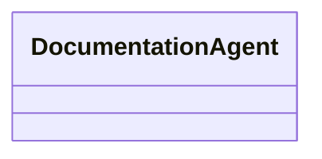
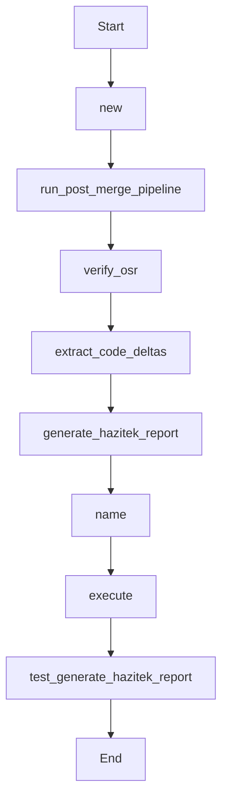

# doc_agent.rs

Source File: `crates/factory-application/src/agents/doc_agent.rs`

## Component Architecture

```mermaid
classDiagram
    class DocumentationAgent
```

## Execution Flow

```mermaid
flowchart TD
    Start --> new
    new --> run_post_merge_pipeline
    run_post_merge_pipeline --> verify_osr
    verify_osr --> extract_code_deltas
    extract_code_deltas --> generate_hazitek_report
    generate_hazitek_report --> name
    name --> execute
    execute --> test_generate_hazitek_report
    test_generate_hazitek_report --> End
```
