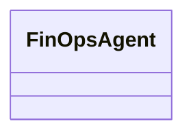
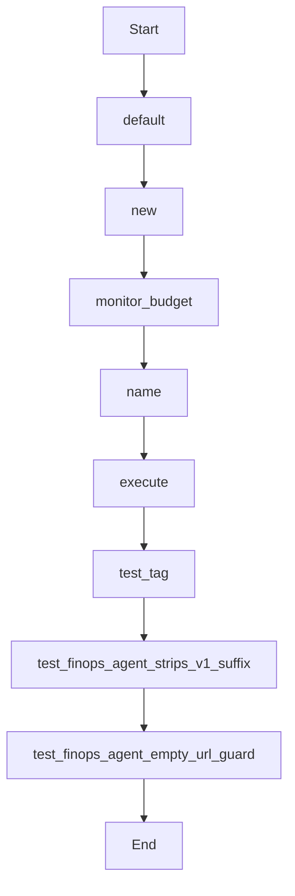

# finops.rs

Source File: `crates/factory-application/src/agents/finops.rs`

## Component Architecture

```mermaid
classDiagram
    class FinOpsAgent
```

## Execution Flow

```mermaid
flowchart TD
    Start --> default
    default --> new
    new --> monitor_budget
    monitor_budget --> name
    name --> execute
    execute --> test_tag
    test_tag --> test_finops_agent_strips_v1_suffix
    test_finops_agent_strips_v1_suffix --> test_finops_agent_empty_url_guard
    test_finops_agent_empty_url_guard --> End
```
