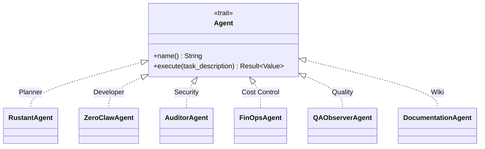

# factory-application::agents — Agent Registry

> **Source**: `crates/factory-application/src/agents/mod.rs`
> **Layer**: Application

---

## UML: Agent Implementations

## Module Re-exports

| Agent | Public API |
|:---|:---|
| `RustantAgent` | `pub use rustant::RustantAgent` |
| `ZeroClawAgent` | `pub use zeroclaw::ZeroClawAgent` |
| `AuditorAgent` | `pub use auditor::AuditorAgent` |
| `FinOpsAgent` | `pub use finops::FinOpsAgent` |
| `QAObserverAgent` | `pub use qa_observer::QAObserverAgent` |
| `DocumentationAgent` | `pub use doc_agent::DocumentationAgent` |

---

> *Related: [Agent Specifications](AGENT-SPECIFICATIONS.md) · [lib.rs](crates_factory-application_src_lib.md)*
