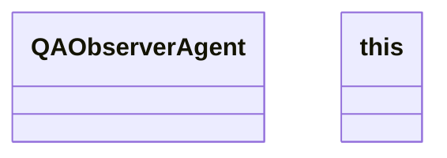
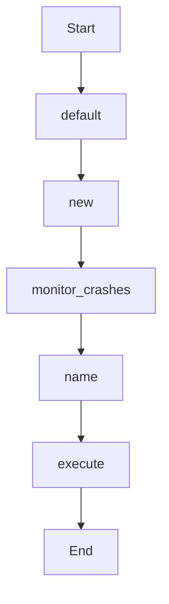

# qa_observer.rs

Source File: `crates/factory-application/src/agents/qa_observer.rs`

## Component Architecture

```mermaid
classDiagram
    class QAObserverAgent
    class this
```

## Execution Flow

```mermaid
flowchart TD
    Start --> default
    default --> new
    new --> monitor_crashes
    monitor_crashes --> name
    name --> execute
    execute --> End
```
