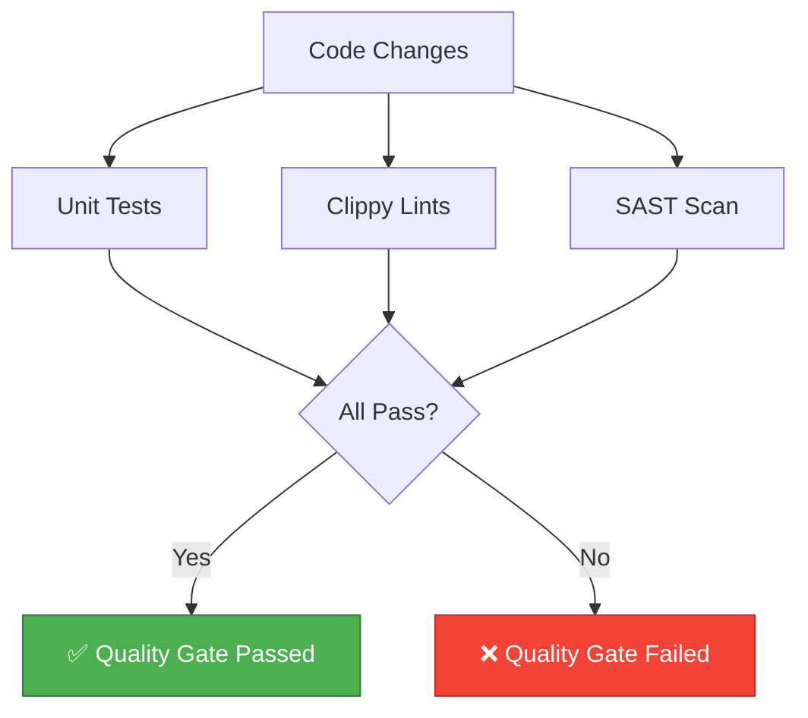

# factory-application::agents::qa_observer — QAObserverAgent

> **Source**: `crates/factory-application/src/agents/qa_observer.rs`
> **Layer**: Application

---

## Quality Gate Enforcement

---

> *Related: [AuditorAgent](crates_factory-application_src_agents_auditor.md) · [Verification Triad](VERIFICATION-TRIAD.md)*
