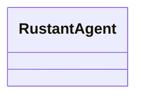
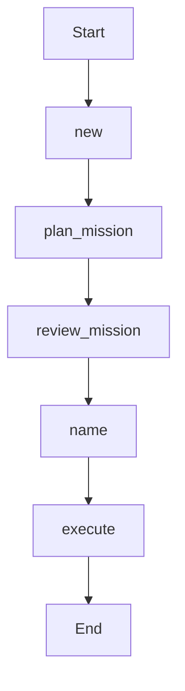

# rustant.rs

Source File: `crates/factory-application/src/agents/rustant.rs`

## Component Architecture

```mermaid
classDiagram
    class RustantAgent
```

## Execution Flow

```mermaid
flowchart TD
    Start --> new
    new --> plan_mission
    plan_mission --> review_mission
    review_mission --> name
    name --> execute
    execute --> End
```
