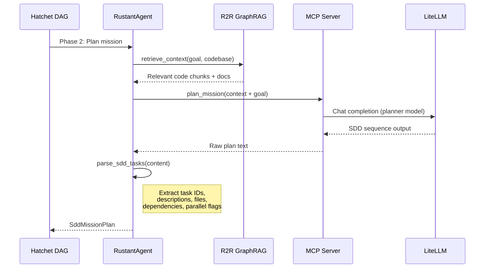

# factory-application::agents::rustant — RustantAgent (Planner)

> **Source**: `crates/factory-application/src/agents/rustant.rs`
> **Layer**: Application

---

## Behavioral Specification

| Attribute | Value |
|:---|:---|
| **Role** | Strategic mission planner — decomposes goals into SDD task sequences |
| **DAG Phase** | Phase 2 (Plan), Phase 5 (Review) |
| **MCP Tools** | `plan_mission`, `retrieve_context`, `security_review`, `search_jira` |

## Planning Sequence Diagram

## SDD 6-Phase Sequence

| Step | Spec-Kit Command | Output |
|:---|:---|:---|
| 1 | `speckit init` | `.specify/` directory |
| 2 | `speckit specify` | `spec.md` |
| 3 | `speckit plan` | `plan.md` |
| 4 | `speckit tasks` | `tasks.md` |
| 5 | `speckit implement` | Code changes |
| 6 | `speckit git-commit` | Git commit |

---

> *Related: [agents/mod.rs](crates_factory-application_src_agents_mod.md) · [ZeroClawAgent](crates_factory-application_src_agents_zeroclaw.md)*
