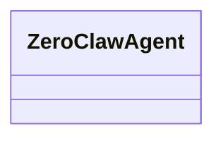
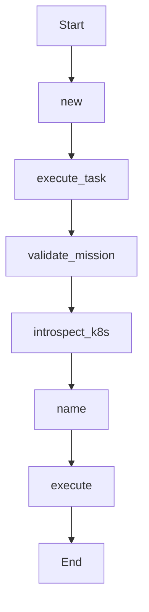

# zeroclaw.rs

Source File: `crates/factory-application/src/agents/zeroclaw.rs`

## Component Architecture

```mermaid
classDiagram
    class ZeroClawAgent
```

## Execution Flow

```mermaid
flowchart TD
    Start --> new
    new --> execute_task
    execute_task --> validate_mission
    validate_mission --> introspect_k8s
    introspect_k8s --> name
    name --> execute
    execute --> End
```
