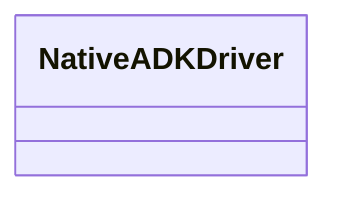
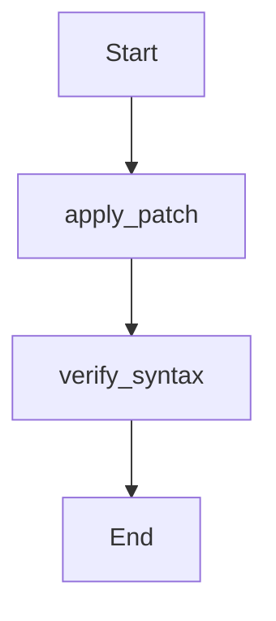

# adk_driver.rs

Source File: `crates/factory-application/src/bridge/adk_driver.rs`

## Component Architecture

```mermaid
classDiagram
    class NativeADKDriver
```

## Execution Flow

```mermaid
flowchart TD
    Start --> apply_patch
    apply_patch --> verify_syntax
    verify_syntax --> End
```
