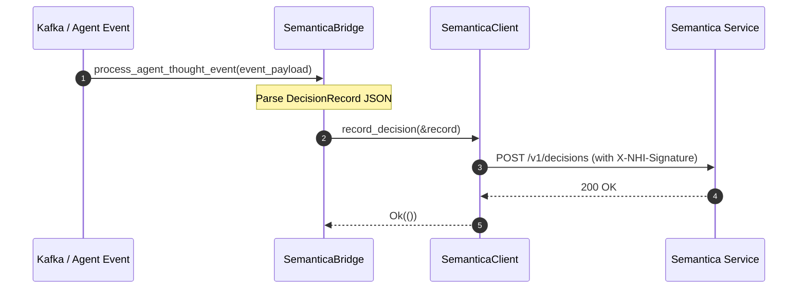

# factory-application::bridge::semantica_bridge — Semantica Decision Bridge

> **Source**: `crates/factory-application/src/bridge/semantica_bridge.rs`  
> **Layer**: Application  
> **Role**: Ingests agent cognitive reasoning events and commits immutable decision records into the Semantica provenance graph.

---

## Decision Recording Sequence



## Payload Data Contract

```rust
pub struct DecisionRecord {
    pub decision_id: String,
    pub agent_id: String,
    pub mission_id: String,
    pub reasoning: String,
    pub ast_node_ids: Vec<String>,
    pub timestamp: String,
}
```

---

> *Related: [semantica.rs](crates_factory-infrastructure_src_semantica.md) · [Tactical Design](TACTICAL-DESIGN.md)*
