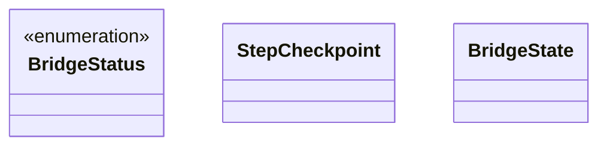
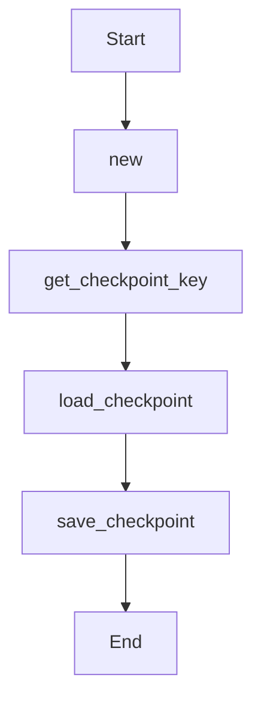

# state.rs

Source File: `crates/factory-application/src/bridge/state.rs`

## Component Architecture

```mermaid
classDiagram
    class BridgeStatus {
        <<enumeration>>
    }
    class StepCheckpoint
    class BridgeState
```

## Execution Flow

```mermaid
flowchart TD
    Start --> new
    new --> get_checkpoint_key
    get_checkpoint_key --> load_checkpoint
    load_checkpoint --> save_checkpoint
    save_checkpoint --> End
```
