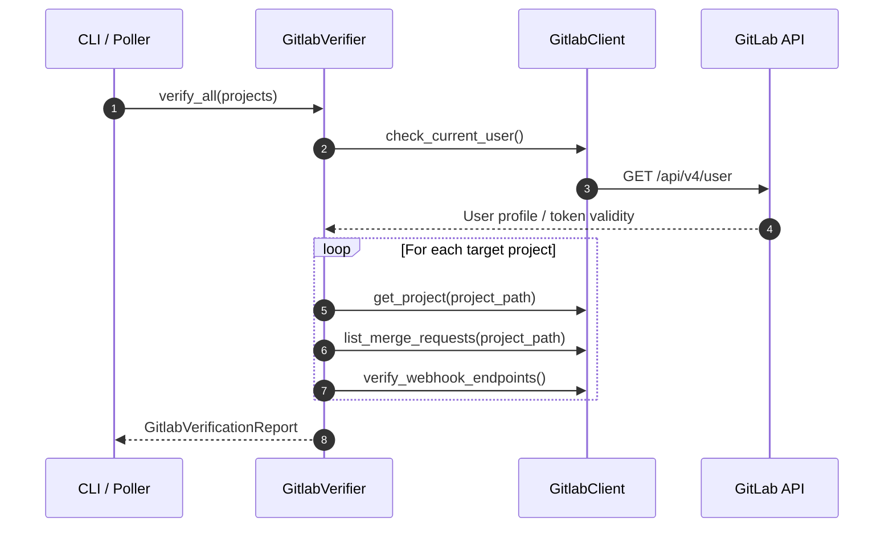

# factory-application::gitlab_verifier — GitLab Integration Verifier

> **Source**: `crates/factory-application/src/gitlab_verifier.rs`  
> **Layer**: Application  
> **Role**: Automated health, authentication, permissions, and CI/CD verification for GitLab Enterprise and cloud instances.

---

## Verification Sequence

## Verification Status Types

- `VerificationStatus::Passed`: All connectivity, token, and project queries succeeded.
- `VerificationStatus::Partial`: Authentication succeeded but specific repositories or permissions failed.
- `VerificationStatus::Failed`: Critical authentication or network failure.

---

> *Related: [gitlab.rs](crates_factory-infrastructure_src_gitlab.md) · [Tactical Design](TACTICAL-DESIGN.md)*
