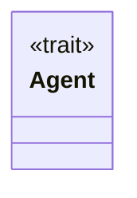
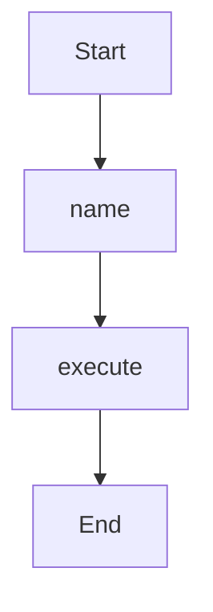

# lib.rs

Source File: `crates/factory-application/src/lib.rs`

## Component Architecture

```mermaid
classDiagram
    class Agent {
        <<trait>>
    }
```

## Execution Flow

```mermaid
flowchart TD
    Start --> name
    name --> execute
    execute --> End
```
