# factory-application — Crate Overview

> **Source**: `crates/factory-application/src/lib.rs`
> **Layer**: Application (Onion Architecture — use case orchestration)

---

## Module Dependency Graph

```mermaid
graph TB
    LIB["lib.rs: Agent trait"] --> AGENTS["agents/"]
    LIB --> WORKFLOWS["workflows/"]
    LIB --> BRIDGE["bridge/"]
    LIB --> POLLER["poller_service.rs"]
    LIB --> TELEMETRY["telemetry_export.rs"]
    LIB --> UTILS["utils/"]

    AGENTS --> RUSTANT["rustant.rs"]
    AGENTS --> ZEROCLAW["zeroclaw.rs"]
    AGENTS --> AUDITOR["auditor.rs"]
    AGENTS --> FINOPS["finops.rs"]
    AGENTS --> QA["qa_observer.rs"]
    AGENTS --> DOC["doc_agent.rs"]

    WORKFLOWS --> AM["autonomous_mission.rs"]
    WORKFLOWS --> CB["circuit_breaker.rs"]
    WORKFLOWS --> DT["develop_task.rs"]
    WORKFLOWS --> PR["pipeline_remediation.rs"]
    WORKFLOWS --> CC["comment_control.rs"]
    WORKFLOWS --> DR["deep_research.rs"]

    BRIDGE --> ADK["adk_driver.rs"]
    BRIDGE --> KAFKA_B["kafka_bridge.rs"]
    BRIDGE --> SEM["semantica_bridge.rs"]
    BRIDGE --> STATE["state.rs"]

    style LIB fill:#2196F3,stroke:#1565C0,color:#fff
```



## Agent Trait Definition

```rust
#[async_trait::async_trait]
pub trait Agent: Send + Sync {
    fn name(&self) -> String;
    async fn execute(&self, task_description: &str) -> anyhow::Result<serde_json::Value>;
}
```

## Crate Dependencies

| Dependency | Purpose |
|:---|:---|
| `factory-core` | Domain entities, security primitives |
| `factory-infrastructure` | Platform adapters, Kafka, R2R |
| `async-openai` | LiteLLM/OpenAI chat completions |
| `reqwest` | HTTP client for Hatchet, LiteLLM APIs |
| `tokio` | Async runtime, `spawn_blocking` |
| `serde_json` | JSON value handling |
| `tracing` | Structured logging |

---

> *Related: [Agent Specifications](AGENT-SPECIFICATIONS.md) · [agents/mod.rs](crates_factory-application_src_agents_mod.md)*
