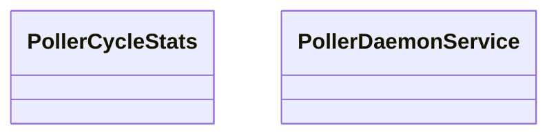
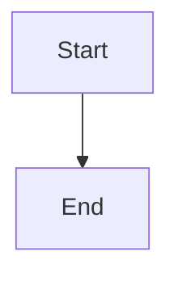

# poller_service.rs

Source File: `crates/factory-application/src/poller_service.rs`

## Component Architecture

```mermaid
classDiagram
    class PollerCycleStats
    class PollerDaemonService
```

## Execution Flow

```mermaid
flowchart TD
    Start --> End
```
