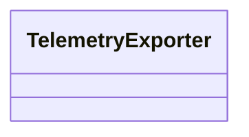
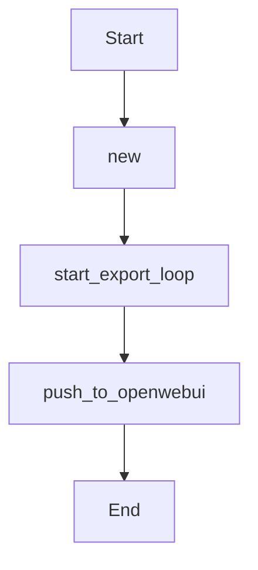

# telemetry_export.rs

Source File: `crates/factory-application/src/telemetry_export.rs`

## Component Architecture

```mermaid
classDiagram
    class TelemetryExporter
```

## Execution Flow

```mermaid
flowchart TD
    Start --> new
    new --> start_export_loop
    start_export_loop --> push_to_openwebui
    push_to_openwebui --> End
```
