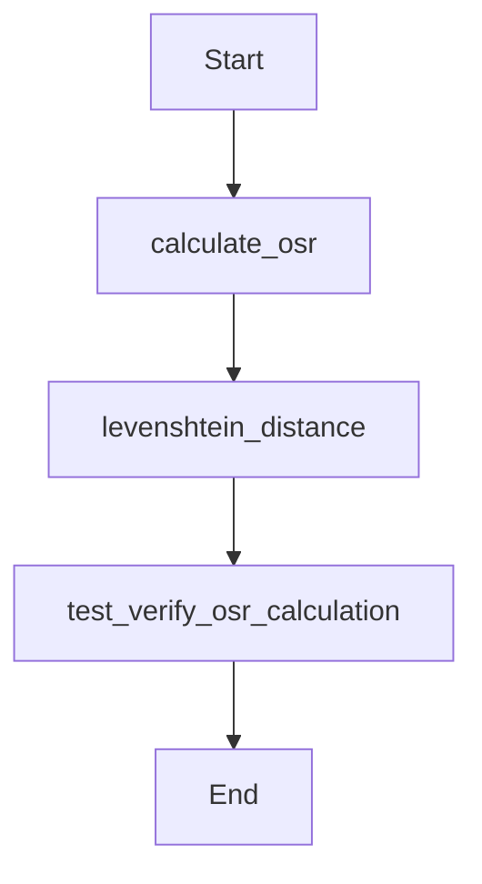

# osr.rs

Source File: `crates/factory-application/src/utils/osr.rs`

## Component Architecture

```mermaid
classDiagram
    class Empty
```

## Execution Flow

```mermaid
flowchart TD
    Start --> calculate_osr
    calculate_osr --> levenshtein_distance
    levenshtein_distance --> test_verify_osr_calculation
    test_verify_osr_calculation --> End
```
