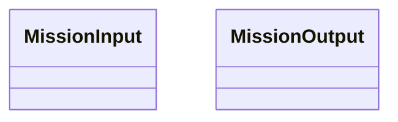
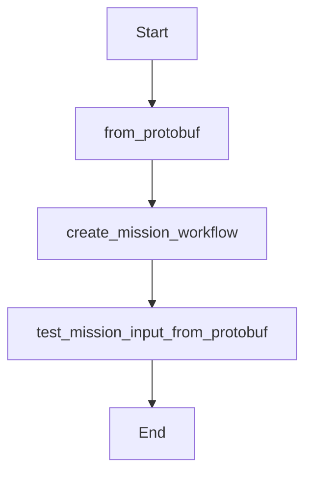

# autonomous_mission.rs

Source File: `crates/factory-application/src/workflows/autonomous_mission.rs`

## Component Architecture

```mermaid
classDiagram
    class MissionInput
    class MissionOutput
```

## Execution Flow

```mermaid
flowchart TD
    Start --> from_protobuf
    from_protobuf --> create_mission_workflow
    create_mission_workflow --> test_mission_input_from_protobuf
    test_mission_input_from_protobuf --> End
```
