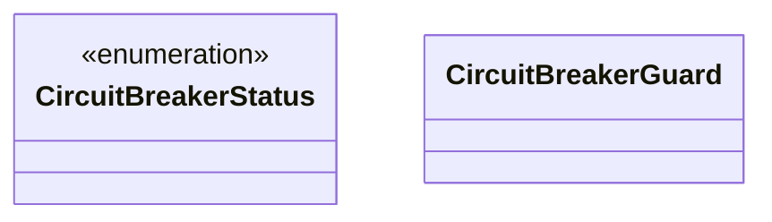
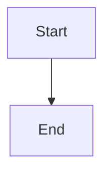

# circuit_breaker.rs

Source File: `crates/factory-application/src/workflows/circuit_breaker.rs`

## Component Architecture

```mermaid
classDiagram
    class CircuitBreakerStatus {
        <<enumeration>>
    }
    class CircuitBreakerGuard
```

## Execution Flow

```mermaid
flowchart TD
    Start --> End
```
