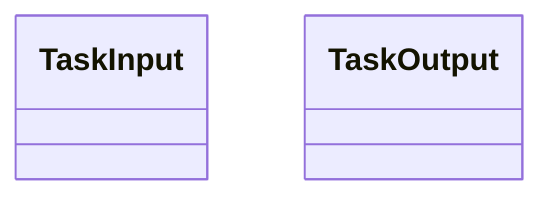
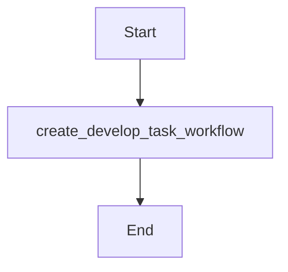

# develop_task.rs

Source File: `crates/factory-application/src/workflows/develop_task.rs`

## Component Architecture

```mermaid
classDiagram
    class TaskInput
    class TaskOutput
```

## Execution Flow

```mermaid
flowchart TD
    Start --> create_develop_task_workflow
    create_develop_task_workflow --> End
```
