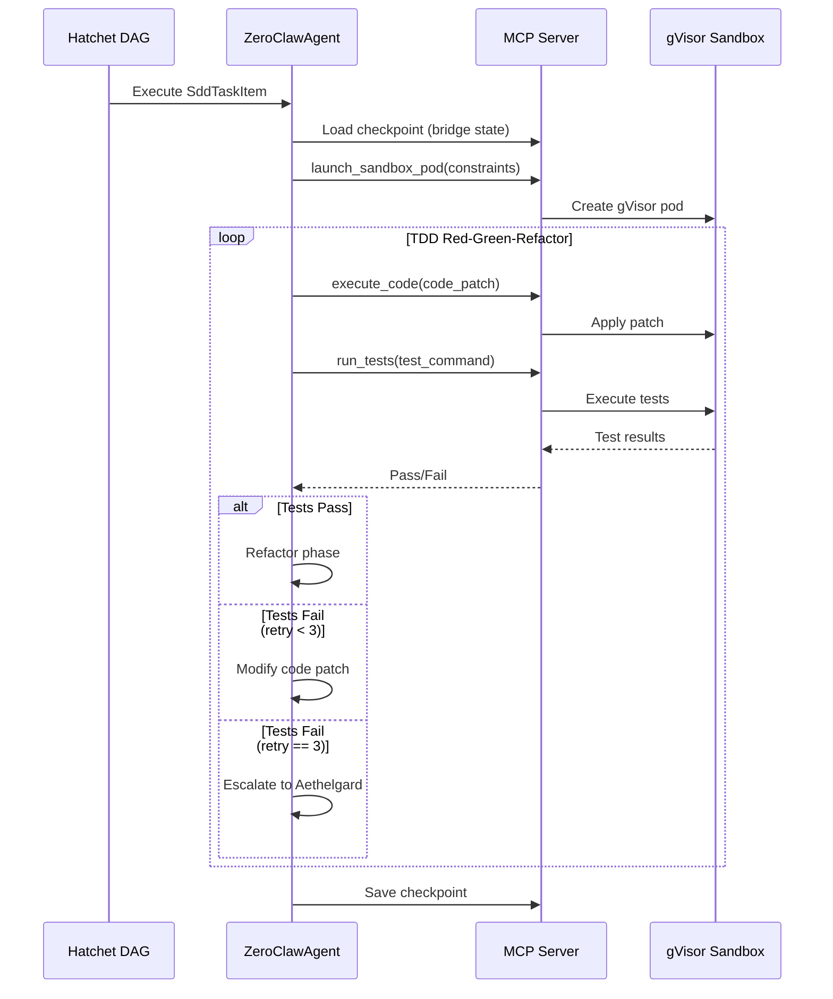

# factory-application::workflows::develop_task — TDD Task Development

> **Source**: `crates/factory-application/src/workflows/develop_task.rs`
> **Layer**: Application

---

## TDD Task Development Sequence

---

> *Related: [circuit_breaker.rs](crates_factory-application_src_workflows_circuit_breaker.md) · [ZeroClawAgent](crates_factory-application_src_agents_zeroclaw.md)*
