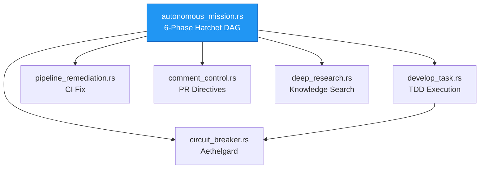

# factory-application::workflows — Workflow Registry

> **Source**: `crates/factory-application/src/workflows/mod.rs`
> **Layer**: Application

---

## Inter-Workflow Dependency Map

---

> *Related: [autonomous_mission.rs](crates_factory-application_src_workflows_autonomous_mission.md)*
