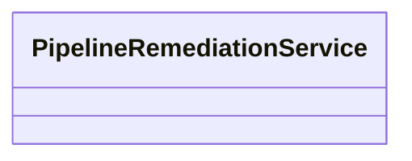
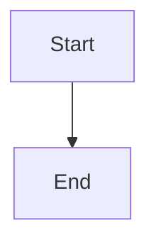

# pipeline_remediation.rs

Source File: `crates/factory-application/src/workflows/pipeline_remediation.rs`

## Component Architecture

```mermaid
classDiagram
    class PipelineRemediationService
```

## Execution Flow

```mermaid
flowchart TD
    Start --> End
```
