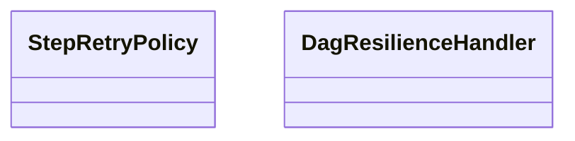
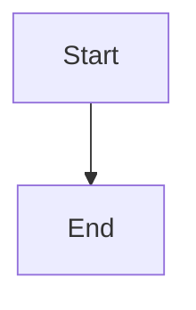

# resilience.rs

Source File: `crates/factory-application/src/workflows/resilience.rs`

## Component Architecture

```mermaid
classDiagram
    class StepRetryPolicy
    class DagResilienceHandler
```

## Execution Flow

```mermaid
flowchart TD
    Start --> End
```
