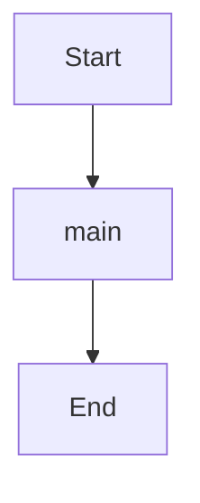

# trigger_mission.rs

Source File: `crates/factory-cli/src/bin/trigger_mission.rs`

## Component Architecture

```mermaid
classDiagram
    class Empty
```

## Execution Flow

```mermaid
flowchart TD
    Start --> main
    main --> End
```
