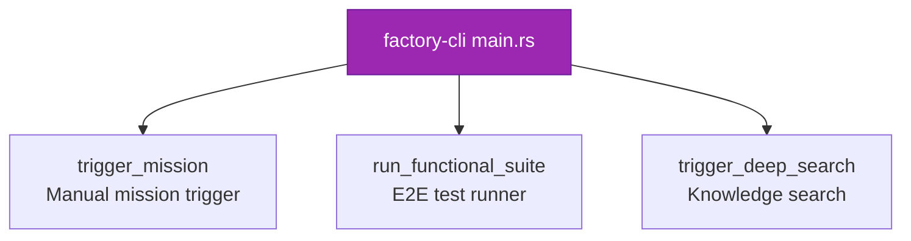

# factory-cli — CLI Entry Point

> **Source**: `crates/factory-cli/src/main.rs`
> **Layer**: Interface

---

## CLI Commands

```mermaid
graph TB
    CLI["factory-cli main.rs"]
    CLI --> TM["trigger_mission<br/>Manual mission trigger"]
    CLI --> RFS["run_functional_suite<br/>E2E test runner"]
    CLI --> TDS["trigger_deep_search<br/>Knowledge search"]

    style CLI fill:#9C27B0,stroke:#6A1B9A,color:#fff
```

---

> *Related: [Tactical Design](TACTICAL-DESIGN.md)*
