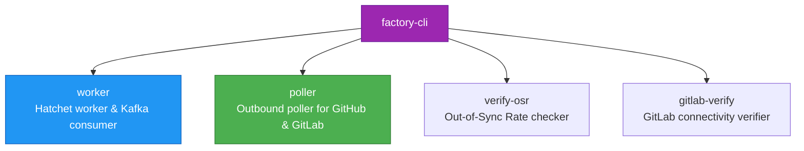

# factory-cli — Command Line Interface

> **Source**: `crates/factory-cli/src/main.rs`  
> **Layer**: Interface  
> **Role**: Primary operational binary providing execution daemons, background workers, OSR validation, and GitLab environment verifiers.

---

## Architecture & Subcommands



## Available Subcommands

### 1. `worker`
Starts the Hatchet mission worker and listens on the Kafka `mission-input` topic:
```bash
cargo run --bin factory-cli -- worker \
    --mcp-url http://localhost:8100 \
    --r2r-url http://localhost:8000 \
    --kafka-brokers localhost:9092
```

### 2. `poller`
Runs the continuous outbound polling daemon checking for issues labeled `autonomous-mission` / `dark-gravity` and PR comments across configured GitHub and GitLab repositories:
```bash
cargo run --bin factory-cli -- poller \
    --github-repos lgcorzo/rust_CACD_autonomous_factory,lgcorzo/mlops-python-package \
    --gitlab-projects lgcorzo-lab/autonomous_factory \
    --interval-secs 30
```

### 3. `gitlab-verify`
Performs comprehensive end-to-end authentication and API checks against GitLab instances:
```bash
cargo run --bin factory-cli -- gitlab-verify \
    --gitlab-url https://gitlab.com \
    --target-projects lgcorzo-lab/autonomous_factory
```

### 4. `verify-osr`
Validates the Out-of-Sync Rate (OSR) of generated documentation against the current R2R knowledge base:
```bash
cargo run --bin factory-cli -- verify-osr --r2r-url http://localhost:8000
```

## Binary Targets in `crates/factory-cli/src/bin/`

- [`trigger_mission`](crates_factory-cli_src_bin_trigger_mission.md): Manually triggers an autonomous mission with custom resource constraints.
- [`run_functional_suite`](crates_factory-cli_src_bin_run_functional_suite.md): Executes the complete end-to-end integration and functional test suite.
- [`trigger_deep_search`](crates_factory-cli_src_bin_trigger_deep_search.md): Triggers asynchronous deep research tasks over Hatchet.

---

> *Related: [Tactical Design](TACTICAL-DESIGN.md) · [User Manual](USER-MANUAL.md)*
