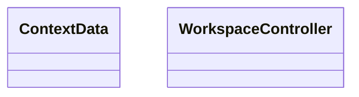
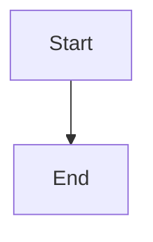

# controller.rs

Source File: `crates/factory-cli/src/operator/controller.rs`

## Component Architecture

```mermaid
classDiagram
    class ContextData
    class WorkspaceController
```

## Execution Flow

```mermaid
flowchart TD
    Start --> End
```
