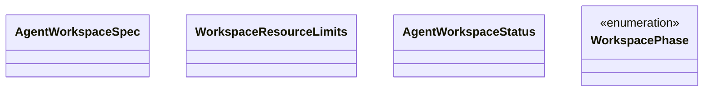
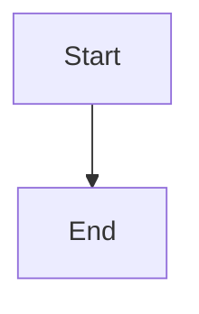

# crd.rs

Source File: `crates/factory-cli/src/operator/crd.rs`

## Component Architecture

```mermaid
classDiagram
    class AgentWorkspaceSpec
    class WorkspaceResourceLimits
    class AgentWorkspaceStatus
    class WorkspacePhase {
        <<enumeration>>
    }
```

## Execution Flow

```mermaid
flowchart TD
    Start --> End
```
