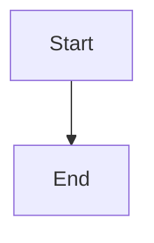

# git_resolver.rs

Source File: `crates/factory-cli/src/operator/git_resolver.rs`

## Component Architecture

```mermaid
classDiagram
    class GitResolver
    class ResolvedCommitInfo
```

## Execution Flow

```mermaid
flowchart TD
    Start --> End
```
