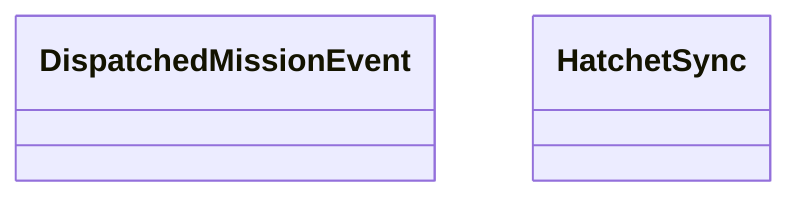
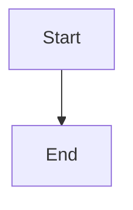

# hatchet_sync.rs

Source File: `crates/factory-cli/src/operator/hatchet_sync.rs`

## Component Architecture

```mermaid
classDiagram
    class DispatchedMissionEvent
    class HatchetSync
```

## Execution Flow

```mermaid
flowchart TD
    Start --> End
```
