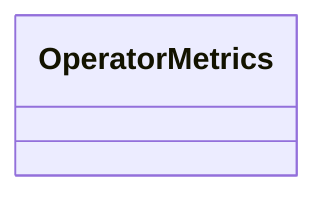
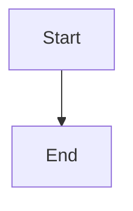

# metrics.rs

Source File: `crates/factory-cli/src/operator/metrics.rs`

## Component Architecture

```mermaid
classDiagram
    class OperatorMetrics
```

## Execution Flow

```mermaid
flowchart TD
    Start --> End
```
