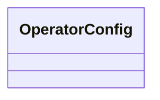
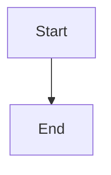

# mod.rs

Source File: `crates/factory-cli/src/operator/mod.rs`

## Component Architecture

```mermaid
classDiagram
    class OperatorConfig
```

## Execution Flow

```mermaid
flowchart TD
    Start --> End
```
